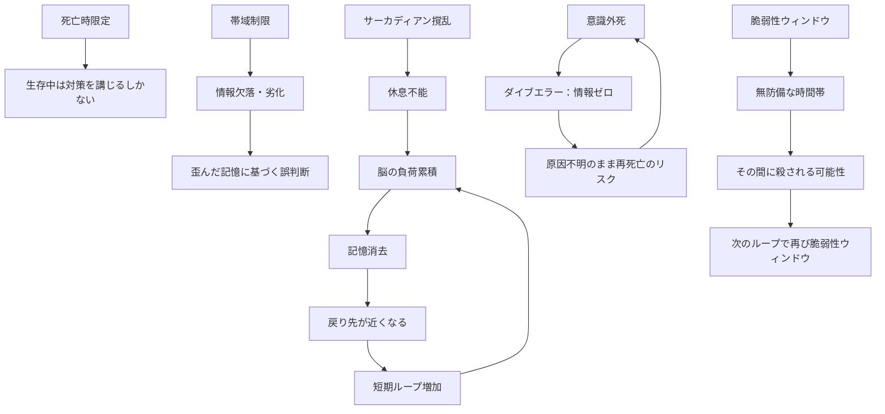

## 付録B：数値・定数／制約・制限一覧

本資料内に登場する全ての数値・定数と、リヴァイブに課せられた全ての制約・制限を一覧化する。創作時の数値調整および設定矛盾の防止に使用する。

---

### 数値・定数一覧

---

#### 転送容量

|数値|対象|内容|参照章|
|---|---|---|---|
|250MB|記憶データ容量|通常転送1回あたりの記憶データ量（圧縮状態）。約5分間の記憶に相当|4.1|
|3回分|記憶フォルダ容量|記憶フォルダが保持できる転送データの上限。4回目で最古が上書き削除|4.3|
|3回分|感覚フォルダ容量|感覚フォルダが保持できる転送データの上限。4回目で最古が上書き削除|4.3|

---

#### 耐久時間と距離

|数値|対象|内容|参照章|
|---|---|---|---|
|10秒＝1日|基本公式|耐久時間（秒）÷10＝戻れる距離（日数）|3.2|
|120秒|耐久時間上限|人間が死の淵で意識を保てる生理的限界。超えることは物理的に不可能|3.2|
|12日前|最大戻り距離|120秒耐えた場合の最大距離。これ以上遠い過去には戻れない|3.2|
|0秒|完全即死|意識を一切保てずに死亡した状態。フェイルセーフの発動条件|3.3|
|5日前|フェイルセーフ距離|完全即死時に自動転送される固定距離|3.3|

---

#### 脆弱性ウィンドウ

|数値|対象|内容|参照章|
|---|---|---|---|
|0〜数秒|フリーズ段階|意識が完全にオフラインになる時間。外界に一切反応不能|5.2|
|数秒〜数十秒|ブート段階|意識が断続的に明滅する時間。反応は不確定|5.2|
|数十秒〜数分|復帰段階|意識が完全に回復するまでの時間|5.2|

---

#### 累積効果の目安

|数値|対象|内容|参照章|
|---|---|---|---|
|1〜5回|記憶混濁（軽度）|ループ記憶を明確に区別可能|8.1|
|6〜15回|記憶混濁（中度）|類似した記憶が混同し始める|8.1|
|16〜30回|記憶混濁（重度）|区別が困難になる|8.1|
|31回以上|記憶混濁（深刻）|自分の経験が信用できなくなる|8.1|
|1〜3回|サーカディアン撹乱（軽度）|時差ぼけ程度。数日で回復|8.2|
|4〜10回|サーカディアン撹乱（中度）|不眠、食欲異常、集中力低下。回復に時間がかかる|8.2|
|11〜20回|サーカディアン撹乱（重度）|昼夜逆転が常態化。睡眠障害|8.2|
|21回以上|サーカディアン撹乱（崩壊）|体内時計の崩壊。常時疲労。回復困難または不可能|8.2|

---

### 制約・制限一覧

---

#### 発動に関する制約

|制約|内容|結果|参照章|
|---|---|---|---|
|死亡時限定|生存中は能力が完全にオフライン|意図的発動・部分発動は不可能|2.2|
|老衰死で発動しない|自然な死は逆命令信号のトリガーにならない|天寿を全うすれば普通に死ぬ|8.5|
|セーブポイント非選択|戻り先を能力者が指定できない|能力が自動選定した地点を受け入れるしかない|3.1|
|耐久時間上限|120秒を超えて意識を保つことは不可能|最大12日前までしか戻れない|3.2|

---

#### 転送に関する制約

|制約|内容|結果|参照章|
|---|---|---|---|
|容量制限|1回の転送で送れる記憶は約250MB（約5分間）|それ以上の情報は転送できない|4.1|
|フォルダ容量制限|記憶・感覚それぞれ3回分まで|4回目以降は最古のデータが上書き削除される|4.3|
|排他的転送|通常は過去の自分にのみ転送|他者への意図的送信は不可能|2.2|
|フォルダへの意図的アクセス不可|格納データの確認・手動削除ができない|転送記憶は受動的に体験するのみ|4.3|
|帯域制限|チャネルの帯域が不足するとデータが損傷する|情報欠落または情報劣化が発生する|6.1, 6.2|
|リリネルの上限|感覚データ量がリリネルを超えると正常転送できない|感覚が歪むか、完全に空白になる|6.3|

---

#### 受信に関する制約

|制約|内容|結果|参照章|
|---|---|---|---|
|脆弱性ウィンドウ|受信時に一時的な機能停止が発生する|フリーズ中は完全に無防備|5.2|
|適応期間|転送直後は認知的混乱が発生する|即座に行動を開始できない|5.1|
|感覚再現|痛みや恐怖がコンプレッションセンスで伝わる|受信のたびに死の苦痛を追体験する|4.2|
|空間認識ズレ|劣化由来または受信時副作用で空間認識が狂う|行動に支障。劣化由来は恒久的|5.3|
|受信タイミング非制御|いつ受信が起こるか選べない|不意のタイミングで脆弱性ウィンドウが発生する|5.2|

---

#### エラーに関する制約

|制約|内容|結果|参照章|
|---|---|---|---|
|脳破壊時の記憶喪失|脳が破壊されると詳細記憶が転送不可|エマージェンシーコネクションに移行し、死亡事実のみ転送|7.1|
|意識外死の完全失敗|死を認識できないと逆命令信号が起動しない|ダイブエラー。時間は戻るが情報はゼロ|7.2|
|オブジェクトエラーの非制御|誤送信を意図的に起こすことも防ぐこともできない|他者に記憶が漏洩するリスクが常に存在する|7.3|
|能力者間の意図的送信不可|協力関係にある能力者同士でも記憶を直接共有できない|情報共有は言葉に頼るしかない|11.2|

---

#### 累積に関する制約

|制約|内容|結果|参照章|
|---|---|---|---|
|脳の負荷累積|使用するたびに脳に物理的負担が蓄積する|休息なしでは記憶が古い順に消去される|8.3|
|負荷と距離の悪循環|記憶消去で戻り先が近くなり、短期ループが増加する|さらに負荷が累積する自己強化型悪循環|8.3|
|サーカディアン撹乱|ループのたびに体内時計がズレる|累積すると睡眠不能→負荷回復不能の悪循環|8.2|
|記憶の混濁|ループ記憶が蓄積して区別できなくなる|正確な判断が困難になる|8.1|
|感覚の鈍化|死の痛みに慣れて感覚が低下する|危機察知能力が低下する|8.1|
|人格の変質|繰り返される死が精神を摩耗させる|人間的感情が希薄化していく|8.1|

---

#### 終了に関する制約

|制約|内容|結果|参照章|
|---|---|---|---|
|能力消失|脳が過負荷状態になると能力が永久に失われる|ラスト1回を使い切った後は通常の人間に戻る|8.4|
|消失の事前通知なし|いつ能力が消失するか能力者に予告されない|「次が最後かもしれない」という不確実性の中で判断を迫られる|8.4|
|意図的消去不可|能力を自分の意志で消すことができない|能力を手放したくても手放せない|12.4|

---

### 制約の相互関係

---
