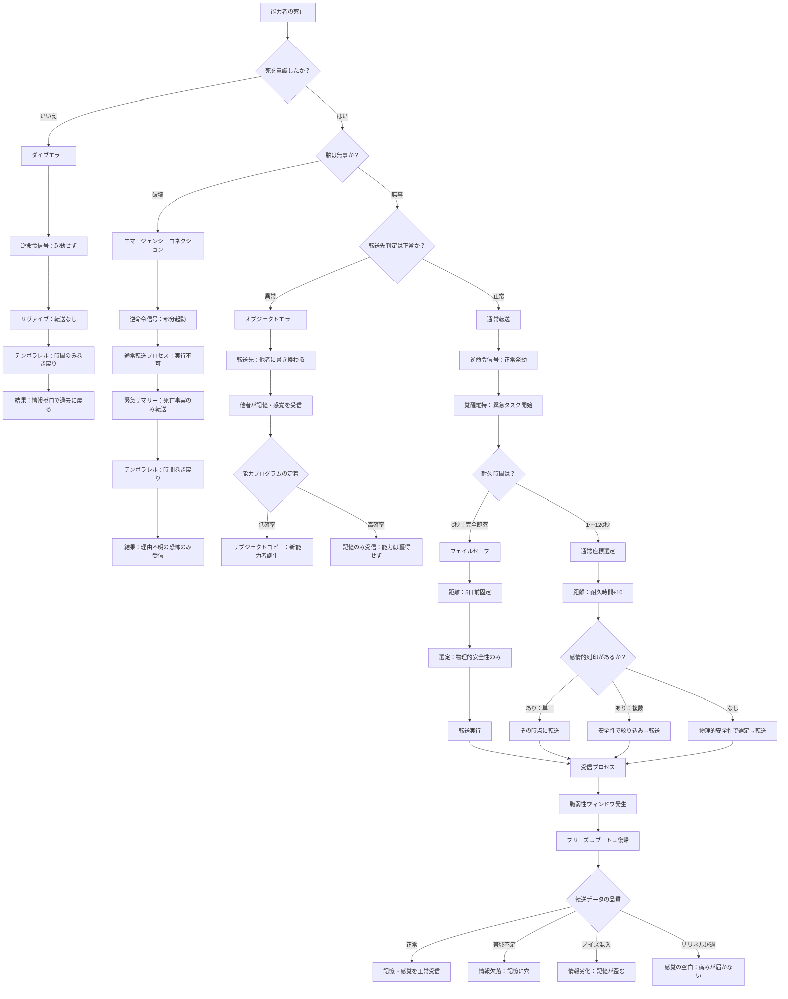

## 付録C：エラー・異常系フローチャート／転送結果マトリクス

本付録では、死亡状況ごとにリヴァイブがどのように挙動するかを、フローチャートとマトリクスの両面から整理する。フローチャートは「流れ」を、マトリクスは「条件と結果の組み合わせ」を示す。

---

### 統合フローチャート

能力者の死亡から転送完了（または失敗）までの全分岐を一枚の図にまとめる。

---

### 転送結果マトリクス

死亡状況を構成する条件（意識の有無、脳の状態、耐久時間、転送先判定）と、その組み合わせによる転送結果を網羅的に対応させる。

---

#### マトリクス1：死亡状況と転送種別

|死を意識したか|脳の状態|転送先判定|発動する機能|転送種別|
|---|---|---|---|---|
|いいえ|—|—|ダイブエラー|転送なし|
|はい|破壊|—|エマージェンシーコネクション|緊急転送|
|はい|無事|異常|オブジェクトエラー|誤送信|
|はい|無事|正常|通常転送|正常転送|

---

#### マトリクス2：転送種別ごとの詳細結果

|項目|通常転送|エマージェンシーコネクション|ダイブエラー|オブジェクトエラー|
|---|---|---|---|---|
|逆命令信号|正常発動|部分起動|起動せず|正常発動|
|記憶転送|約250MB（5分間相当）|不可能|なし|約250MB（他者へ）|
|感覚転送|可能|最小限（恐怖のみ）|なし|可能（他者へ）|
|転送先|過去の自分|過去の自分|—|他者|
|時間の巻き戻り|発生する|発生する|発生する|発生する|
|受信側の体験|詳細な記憶と感覚|理由不明の恐怖|何も起こらない|他人の記憶が流入|
|脆弱性ウィンドウ|発生する|発生する（短い）|発生しない|受信者に発生する|
|能力者の情報獲得|死因・状況が分かる|「死んだ」事実のみ|何も分からない|能力者自身は情報なし|

---

#### マトリクス3：耐久時間と転送結果の関係（通常転送時）

| 耐久時間   | 戻れる距離   | 座標選定      | 転送データ量      | 受信時負荷 | 脆弱性ウィンドウ |
| ------ | ------- | --------- | ----------- | ----- | -------- |
| 0秒（即死） | 5日前（固定） | 物理的安全性のみ  | 最小限（死因情報なし） | 最小限   | 短め       |
| 10秒    | 1日前     | 感情的刻印→安全性 | 小           | 低     | 短い       |
| 30秒    | 3日前     | 感情的刻印→安全性 | 小〜中         | 低〜中   | やや短い     |
| 60秒    | 6日前     | 感情的刻印→安全性 | 中           | 中     | 中程度      |
| 90秒    | 9日前     | 感情的刻印→安全性 | 中〜大         | 中〜高   | やや長い     |
| 120秒   | 12日前    | 感情的刻印→安全性 | 大           | 高     | 長い       |

---

#### マトリクス4：転送データの品質パターン

|帯域状態|ノイズ|リリネル|記憶の状態|感覚の状態|能力者の体験|
|---|---|---|---|---|---|
|十分|なし|十分|正常|正常|死因が分かり、痛みも正確に伝わる|
|十分|あり|十分|劣化（歪み）|正常|記憶が微妙に不正確だが気づけない。痛みは正確|
|不足|なし|十分|欠落（穴）|正常|記憶に空白がある（自覚可能）。痛みは正確|
|十分|なし|不足|正常|歪みまたは空白|記憶は正確だが、痛みが歪んでいるか感じない|
|不足|あり|不足|欠落＋劣化|歪みまたは空白|記憶に穴があり、残った記憶も不正確。痛みも不完全|

---

#### マトリクス5：脳の負荷状態と各機能への影響

|負荷状態|通常転送|耐久時間|脆弱性ウィンドウ|帯域状態|リリネル|情報品質|
|---|---|---|---|---|---|---|
|低（休息十分）|正常|通常通り|短い|十分|十分|高い|
|中（やや蓄積）|正常|通常通り|やや長い|やや不足気味|やや低下|欠落・劣化の可能性あり|
|高（休息不足）|正常だが品質低下|通常通り|長い|不足|低下|欠落・劣化が発生しやすい|
|限界（過負荷直前）|正常だが品質著しく低下|通常通り|非常に長い|著しく不足|著しく低下|ほぼ確実に損傷が発生|
|過負荷|ラスト1回のみ|通常通り|—|—|—|能力消失へ|

---

#### マトリクス6：非能力者への影響（管の損傷パターン別）

|損傷パターン|巻き戻りの規模|累積記憶が残る範囲|既視感の発生範囲|記憶流入の可能性|
|---|---|---|---|---|
|破裂（局所的）|限定的|能力者の周辺の人間|周辺のごく少数|低い|
|漏出（広域的）|広範囲|広範囲の人間|比較的多くの人間|やや高い|

---

### 死因別クイックリファレンス

具体的な死因から、どの転送結果になるかを即座に引けるようにする。

| 死因             | 意識の有無    | 脳の状態    | 発動する機能                                         | 能力者が得る情報              |
| -------------- | -------- | ------- | ---------------------------------------------- | --------------------- |
| 刺殺（腹部）         | あり       | 無事      | 通常転送                                           | 死因・状況・痛みの全て           |
| 銃撃（胸部）         | あり       | 無事      | 通常転送                                           | 死因・状況・痛みの全て           |
| 銃撃（頭部・即死）      | なし       | 破壊      | ダイブエラー                                         | 何も得られない               |
| 銃撃（頭部・一瞬の意識あり） | あり       | 破壊      | エマージェンシーコネクション                                 | 死んだ事実のみ               |
| 背後からの狙撃        | なし       | 状況による   | ダイブエラー                                         | 何も得られない               |
| 睡眠中の暗殺         | なし       | 状況による   | ダイブエラー                                         | 何も得られない               |
| 無臭毒ガス          | なし       | 無事      | ダイブエラー                                         | 何も得られない               |
| 毒殺（徐々に効く毒）     | あり（気づけば） | 無事      | 通常転送                                           | 死因・状況・痛み              |
| 爆発（至近距離）       | なし       | 破壊      | ダイブエラー                                         | 何も得られない               |
| 爆発（やや距離あり）     | あり（一瞬）   | 状況による   | エマージェンシーコネクションまたは通常転送                          | 状況による                 |
| 溺死             | あり       | 無事      | 通常転送                                           | 死因・状況・苦しさ             |
| 転落死（高所）        | あり       | 状況による   | 通常転送（着地前に意識あり）。ただし着地時に脳が破壊された場合はエマージェンシーコネクション | 死因・恐怖・痛み（脳破壊時は死亡事実のみ） |
| 焼死             | あり       | 無事      | 通常転送                                           | 死因・状況・痛み              |
| 窒息死            | あり       | 無事      | 通常転送                                           | 死因・状況・苦しさ             |
| 老衰             | —（判定不要）  | —（判定不要） | 発動しない                                          | —                     |
| 病死（穏やかな死）      | 状況による    | 無事      | 状況による                                          | 状況による                 |

---

### 判定フロー（簡易版）

迷った場合は以下の順番で判定する。

---

#### 第1段階：何が発動するか

| 順番  | 問い            | はい             | いいえ                        |
| --- | ------------- | -------------- | -------------------------- |
| 1   | 老衰か？          | → 能力は発動しない（終了） | → 次へ                       |
| 2   | 能力者は死を認識できたか？ | → 次へ           | → ダイブエラー（時間のみ巻き戻り、情報ゼロ）    |
| 3   | 脳は物理的に無事か？    | → 次へ           | → エマージェンシーコネクション（死亡事実のみ転送） |
| 4   | 転送先判定は正常か？    | → 通常転送へ進む      | → オブジェクトエラー（他者へ送信）         |

---

#### 第2段階：どこに戻るか（通常転送時）

|順番|問い|はい|いいえ|
|---|---|---|---|
|5|完全即死（耐久時間0秒）か？|→ フェイルセーフ（5日前・安全性優先）|→ 次へ|
|6|耐久時間÷10で距離を算出|→ 距離確定|—|
|7|範囲内に感情的刻印があるか？|→ その時点が転送先候補|→ 物理的安全性で選定|
|8|感情的刻印の候補は複数あるか？|→ 安全性が高い方を選定|→ その時点に転送|

---

#### 第3段階：何が届くか（転送データの品質）

|順番|問い|はい|いいえ|
|---|---|---|---|
|9|記憶チャネルの帯域は十分か？|→ 記憶は正常|→ 情報欠落（記憶に穴）|
|10|記憶チャネルにノイズ混入はあるか？|→ 情報劣化（記憶が歪む。自覚不能）|→ 記憶は正確|
|11|感覚データ量はリリネル以内か？|→ 感覚は正常に転送|→ 次へ|
|12|リリネル超過の程度は？|軽度 → 歪んだ感覚 / 重度 → 感覚の空白|—|

---

#### 第4段階：受信時に何が起こるか

|順番|問い|はい|いいえ|
|---|---|---|---|
|13|脆弱性ウィンドウが発生する|→ フリーズ→ブート→復帰の順に進行|—（必ず発生する）|
|14|脳の負荷累積は高いか？|→ ウィンドウが長くなる|→ ウィンドウは通常の長さ|
|15|空間認識ズレは発生するか？|→ 劣化由来（恒久的）か受信時副作用（一時的）か判断が必要|→ 空間認識は正常|

---

#### 第5段階：オブジェクトエラー時の追加判定

|順番|問い|はい|いいえ|
|---|---|---|---|
|16|受信者の脳に能力プログラムが定着したか？|→ サブジェクトコピー（新能力者誕生）|→ 記憶のみ受信（能力は獲得せず）|

---
