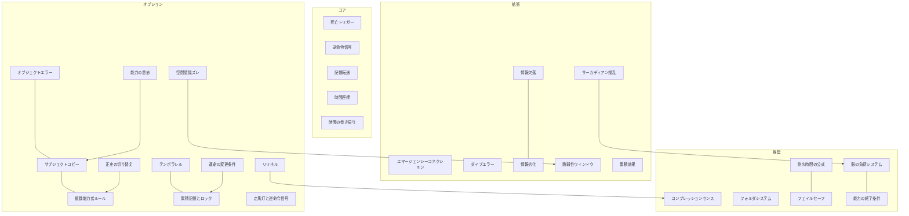

## 付録D：カスタマイズ＆モジュール構成ガイド

本付録では、リヴァイブの設定要素を独立度に基づいて分類し、自作品への導入時に「何を持っていくか」「変えるとどこに響くか」を判断するためのガイドを提供する。

---

### モジュール分類

全設定要素を「コア」「推奨」「拡張」「オプション」の四層に分類する。

---

#### コア（これだけで死に戻り能力として最低限成立する）

|要素|内容|削除した場合|
|---|---|---|
|死亡トリガー|死亡時にのみ発動する|リヴァイブの根本が崩壊する|
|逆命令信号|死亡を検知して転送を開始する信号|発動メカニズムが存在しなくなる|
|記憶転送|記憶を過去の自分に送る|「死に戻り」にならない|
|時間座標（基本）|過去のどこかに戻る|戻り先が定義できない|
|時間の巻き戻り|可変の時間が過去に戻る|ループが成立しない|

---

#### 推奨（コアだけでは薄いので入れた方がいい）

|要素|内容|削除した場合|セット推奨|
|---|---|---|---|
|コンプレッションセンス|痛みや恐怖も転送される|死に戻りの「代償感」が薄れる|—|
|フォルダシステム|記憶・感覚が各3回分まで保持|情報が無限に蓄積可能になり、チート化する|—|
|耐久時間と距離の公式|10秒＝1日、上限120秒|戻れる距離の根拠がなくなる|フェイルセーフ|
|フェイルセーフ|完全即死時に5日前固定|即死＝永久死亡になりうる|耐久時間の公式|
|脳の負荷システム|使用ごとに累積、休息で回復|能力が無制限のチートになる|能力の終了条件|
|能力の終了条件|過負荷→ラスト1回→消失|物語に「終わり」が設定できない|脳の負荷システム|

---

#### 拡張（物語に深みと緊張感を加える）

|要素|内容|削除した場合|セット推奨|
|---|---|---|---|
|エマージェンシーコネクション|脳破壊時に死亡事実のみ転送|脳破壊＝完全なダイブエラーになる|—|
|ダイブエラー|意識外死で転送完全失敗|不意打ちへの脆弱性がなくなる|—|
|情報欠落（データロス）|帯域不足で記憶に穴|転送が常に完璧になる|情報劣化|
|情報劣化（データデグラデーション）|ノイズで記憶が歪む|「信頼できない記憶」の要素がなくなる|情報欠落|
|脆弱性ウィンドウ|受信時に無防備になる|受信にリスクがなくなる|—|
|累積効果（副作用全般）|記憶混濁、感覚鈍化、時間感覚喪失、人格変質|ループの代償が脳負荷だけになる|—|
|サーカディアン撹乱|体内時計の崩壊|「休めない」という悪循環要素が弱まる|脳の負荷システム|

---

#### オプション（特定の物語展開をしたい場合に採用する）

|要素|内容|必要な場面|セット推奨|
|---|---|---|---|
|オブジェクトエラー|他者への誤送信|能力の秘密が漏洩する展開|サブジェクトコピー|
|サブジェクトコピー|誤送信から新能力者が誕生|複数能力者の物語|オブジェクトエラー＋複数能力者ルール|
|複数能力者ルール|独立発動、記憶衝突、正史|能力者同士の対立や協力|サブジェクトコピー|
|テンポラレル|二層時間構造、パイプライン|世界の時間構造を描く、累積記憶の理由を説明する|累積記憶|
|リリネル|感覚転送の帯域制限|「痛みが届かない」恐怖を描く|コンプレッションセンス|
|累積記憶とロック|非能力者にも記憶の痕跡が残る|非能力者視点の物語、既視感の演出|テンポラレル（理由を説明する場合）|
|走馬灯と逆命令信号|走馬灯＝圧縮処理の再解釈|能力の起源を探る物語|—|
|空間認識ズレ|受信後の身体的異常|受信直後の混乱を詳細に描く|脆弱性ウィンドウ|
|正史の切り替え|主観的な正史認識が変わる|アイデンティティを問う物語|複数能力者ルール|
|運命の変更条件|能力者の介入による非能力者の運命分岐|恋愛・人間関係の展開、非能力者の運命を描く物語|累積記憶とロック|
|能力の意志|能力自体が増殖や存続を「望む」かのように振る舞う性質|呪いとしてのループ、能力からの解放を描く物語|サブジェクトコピー|

---

### セット推奨の依存関係図

---

### 数値カスタマイズガイド

各数値を変更した場合に、設定のどこに影響が波及するかを示す。

---

#### 記憶容量（デフォルト：250MB／約5分間）

|変更方向|変更例|影響する要素|バランスへの影響|
|---|---|---|---|
|増加|500MB／約10分間|転送データ量増加→受信時負荷増大→脆弱性ウィンドウ長期化→脳の負荷累積加速|情報量が増えて有利だが、代償も重くなる|
|減少|100MB／約2分間|転送データ量減少→受信時負荷軽減→脆弱性ウィンドウ短縮→脳の負荷累積緩和|情報量が減って不利だが、身体への負担は軽い|

---

#### フォルダ容量（デフォルト：各3回分）

|変更方向|変更例|影響する要素|バランスへの影響|
|---|---|---|---|
|増加|各5回分|情報蓄積量増加→記憶混濁の発生が遅れる→チート感が増す|能力者が有利になりすぎる可能性。負荷システムを重くして相殺するか検討|
|減少|各1回分|情報が即座に上書きされる→常に最新1回分しかない→判断材料が極端に少ない|非常にシビアな設定。短編やホラー向き|

---

#### 耐久時間の公式（デフォルト：10秒＝1日、上限120秒＝12日前）

|変更方向|変更例|影響する要素|バランスへの影響|
|---|---|---|---|
|公式の倍率変更|5秒＝1日|短い耐久時間でも遠くに戻れる→生存が容易になる→フェイルセーフの相対的価値低下|テンポの速い物語向き|
|公式の倍率変更|20秒＝1日|長く耐えないと遠くに戻れない→死の苦痛を長く味わう必要→代償感が強まる|ハードな物語向き|
|上限の変更|上限60秒＝6日前|戻れる距離が大幅に短くなる→やり直し期間が限定的→緊張感が増す|短期間で決着をつける物語向き|
|上限の変更|上限300秒＝30日前|戻れる距離が大幅に伸びる→準備期間が長くなる→戦略性が増す|長期計画型の物語向き|

---

#### フェイルセーフ距離（デフォルト：5日前固定）

|変更方向|変更例|影響する要素|バランスへの影響|
|---|---|---|---|
|増加|10日前固定|即死時の猶予が大きくなる→即死のリスクが相対的に低下|即死＝最悪の死に方という構図が弱まる|
|減少|2日前固定|即死時の猶予が極小→情報なし＋時間なしの二重苦|即死の恐怖が極端に増す。ホラー向き|
|廃止|フェイルセーフなし|即死＝情報もなく戻り先も不確定→事実上のダイブエラーに近づく|非常にハードな設定|

---

#### 脆弱性ウィンドウ（デフォルト：フリーズ0〜数秒／ブート数秒〜数十秒／復帰数十秒〜数分）

|変更方向|変更例|影響する要素|バランスへの影響|
|---|---|---|---|
|短縮|フリーズ1秒／ブート3秒／復帰10秒|無防備時間が極めて短い→受信のリスクが低い→アクション向き|テンポが速くなるが、受信の恐怖感は薄れる|
|延長|フリーズ10秒／ブート1分／復帰5分|無防備時間が長い→戦闘中の受信が致命的→安全な場所の確保が必須|サバイバル要素が強まる|

---

### 要素削除時の影響チェックリスト

特定の要素を削除する場合、以下の連鎖影響を確認する。

---

#### テンポラレルを削除する場合

| 影響箇所                      | 対処方法                                             |
| ------------------------- | ------------------------------------------------ |
| 「なぜ時間が巻き戻るのか」の説明がなくなる     | 「リヴァイブの能力自体が時間を巻き戻す」と再定義する                       |
| ダイブエラー時の「時間だけ戻る」理由が説明できない | 「リヴァイブの発動有無にかかわらず、能力者の死亡自体が時間の巻き戻りを引き起こす」とルール化する |
| 非能力者の累積記憶の理由が説明できない       | 「そういうものである」と処理するか、累積記憶の設定自体を削除する                 |
| 管の破裂・漏出による影響範囲の違いが使えない    | 全ループで影響範囲を固定にするか、累積記憶の設定自体を削除する                  |

---

#### オブジェクトエラーを削除する場合

|影響箇所|対処方法|
|---|---|
|サブジェクトコピーが発生しなくなる|複数能力者が必要なら別の発現経路を用意する（先天的発現など）|
|能力の秘密が誤送信で漏洩する展開が使えない|秘密の露見は別の手段（目撃、推理、自白など）で描く|
|複数能力者ルールの一部が不要になる|記憶衝突と正史の切り替えはオブジェクトエラー前提なので削除する|

---

#### 脳の負荷システムを削除する場合

|影響箇所|対処方法|
|---|---|
|能力が無制限のチートになる|別の制限を設ける（回数制限、時間制限、精神的代償など）|
|能力の終了条件がなくなる|別の終了条件を設ける（特定のイベント、外部からの消去など）|
|悪循環の構造が消える|別のエスカレーション構造を導入する|
|サーカディアン撹乱の意味が薄れる|サーカディアン撹乱自体を削除するか、独立した副作用として残す|

---

#### コンプレッションセンスを削除する場合

|影響箇所|対処方法|
|---|---|
|感覚フォルダが不要になる|フォルダシステムを記憶フォルダのみに簡略化する|
|リリネルが不要になる|リリネルの概念を削除する|
|記憶と感覚の非対称性が使えない|「記憶欠損」のみで代償感を出す|
|「痛みが届かない恐怖」の演出が使えない|別の恐怖演出に置き換える|

---

### 追加推奨ポイント

本資料に含まれていないが、作品に応じて追加を検討すると良い要素。

|追加候補|内容|相性の良いモジュール|
|---|---|---|
|能力者同士の検知機能|近くにいる能力者を感知できる|複数能力者ルール|
|転送時の視覚演出|受信時に能力者が見る光景の描写ルール|脆弱性ウィンドウ|
|能力の段階的覚醒|最初は制限付きで徐々に機能が解放される|脳の負荷システム|
|転送記憶の共有手段|特定条件下で他者に記憶を見せられる|オブジェクトエラー|
|テンポラレルの観測手段|特殊な装置や条件で不変の時間を観測できる|テンポラレル|
|能力の意図的な消去方法|特定の手段で能力を消せる|能力の終了条件|

---
