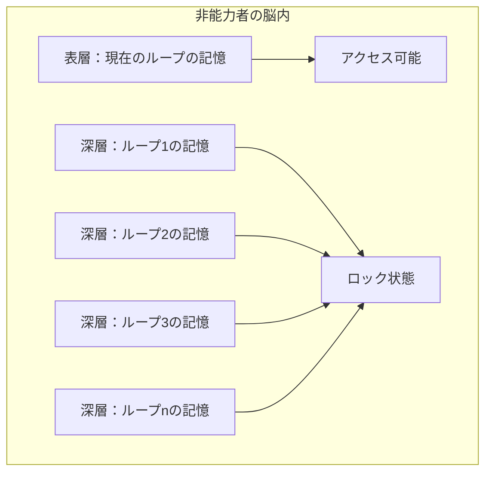
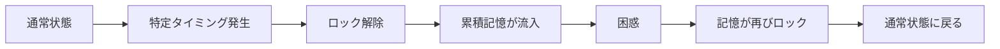
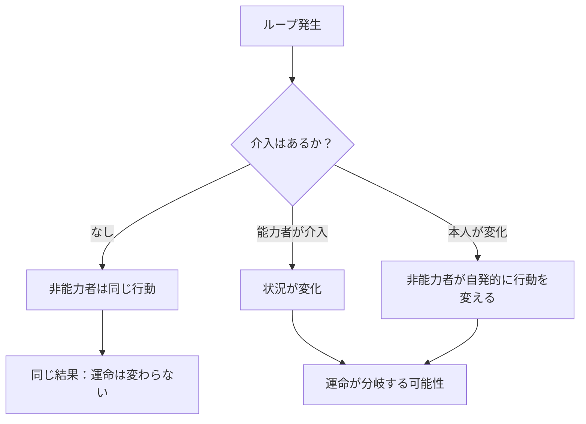

## 第10章：周囲への影響

リヴァイブはループする能力者だけでなく、周囲の人間にも影響を及ぼす。この章では、能力を持たない者たちがループによってどのような影響を受けるか、そして彼らの運命を変えることは可能なのかを解説する。

---

### 10.1 累積記憶とロック

ループが繰り返されるたび、非能力者にも「累積記憶」が蓄積されていく。ただし、この記憶は通常アクセスできない状態でロックされている。

|項目|内容|
|---|---|
|累積記憶|各ループの記憶が非能力者にも蓄積される|
|状態|固くロックされている|
|通常時|アクセス不可能（本人も気づかない）|
|特定タイミング|稀にロックが解除され、記憶が流れ込む|

---

#### 累積記憶の構造

非能力者の脳内には、各ループで経験した記憶が層のように積み重なっている。しかし、これらの記憶は通常の意識からは完全に遮断されており、本人は自分が「何度も同じ時間を生きた」ことを認識できない。

第9章で解説した通り、累積記憶が蓄積される理由はテンポラレルの二層構造に由来する。可変の時間が巻き戻っても、不変の時間では「一度流れた事実」が消えない。この不変の時間に蓄積された痕跡が、非能力者の脳に累積記憶として残る。

---

#### 既視感について

|項目|内容|
|---|---|
|デジャヴ|感じない|
|既視感|「これどこかで…」という感覚はあり得る|
|原因|ロックされた累積記憶の断片的な漏出|

厳密な意味でのデジャヴ（同じ体験の再現感覚）は発生しない。しかし、「これどこかで見た気がする」「なぜか分からないけど懐かしい」といった曖昧な既視感を覚えることはある。これは累積記憶のロックが不完全な場合に起こる現象であり、不変の時間の層から可変の時間の層への微小な漏出として説明される。

---

#### 記憶の流入

特定のタイミングで、ロックされていた累積記憶が突然流れ込むことがある。

|項目|内容|
|---|---|
|発生条件|不明確（特定できない）|
|発生時の反応|「え？」という困惑|
|流入する内容|過去のループで経験した記憶の断片|
|持続時間|一瞬〜数秒程度|

---

#### 流入時の体験例

|状況|体験|
|---|---|
|初対面の人物|「なぜかこの人を知っている気がする」|
|未訪問の場所|「来たことないはずなのに、道が分かる」|
|未経験の出来事|「これから何が起こるか、なんとなく分かる」|
|能力者との会話|「この会話、前にもした気がする」|

これらの体験は非能力者にとって説明のつかない出来事であり、多くの場合「気のせい」として処理される。しかし、流入の頻度や鮮明さが増した場合、非能力者は自分の認知に疑問を持ち始める可能性がある。

---

### 10.2 運命の変更条件

ループが繰り返されても、非能力者の運命は基本的に変化しない。運命を変えるには、明確な介入が必要である。

|項目|内容|
|---|---|
|基本原則|ループしても非能力者の運命は変わらない|
|変更条件1|能力者が回避行動をとる|
|変更条件2|非能力者本人が行動を変える|
|変更なし|同じ選択、同じ結果が繰り返される|

---

#### 運命の固定性

非能力者は自分がループしていることを知らない。そのため、同じ状況では同じ判断を下し、同じ行動をとる。能力者が介入しない限り、彼らの運命は何度ループしても変わらない。

これはリヴァイブの最も残酷な側面の一つである。能力者は「このままでは誰かが死ぬ」と分かっていても、介入しなければその死は繰り返される。そして介入するたびに、その知識がどこから来たのかを説明できない。

---

#### 能力者の介入による変更

能力者がループの知識を活かして行動することで、非能力者の運命を変えることができる。

|介入例|内容|
|---|---|
|警告|危険を事前に伝える|
|物理的阻止|事故や攻撃から守る|
|状況操作|出会いや選択の機会を変える|
|情報提供|判断材料を与える|

ただし、介入には常にリスクが伴う。能力者が「なぜそれを知っているのか」を説明できなければ、不信感を生む。説明したところで信じてもらえない可能性が高い。繰り返し介入すれば、能力者自身が「異常な存在」として周囲から孤立する。

---

#### 本人の変化による変更

稀に、非能力者が自発的に異なる行動をとることがある。

|要因|内容|
|---|---|
|累積記憶の漏出|無意識に過去のループの経験が影響|
|直感|「なんとなく」別の選択をする|
|偶然|外部要因による行動の変化|

累積記憶の漏出がどの程度行動に影響するかは不明確である。しかし、「なんとなく今日はこの道を通りたくない」「理由は分からないけど今日は家にいたい」といった微細な判断の変化が、結果として運命を変えることはありうる。

---

#### 観測者の不在

|項目|内容|
|---|---|
|観測者の存在|いない|
|ループの認識|能力者以外には不可能|
|記録|残らない（累積記憶はロック状態）|

リヴァイブによるループを客観的に観測できる存在はいない。非能力者にとって、時間は常に一方向に流れており、「巻き戻った」という事実を認識する手段がない。記録も残らない。監視カメラも、日記も、データベースも、全てが巻き戻り前の状態に戻される。

能力者だけが、同じ人々が同じ運命を繰り返す様を何度も見ることになる。この非対称性が、能力者の深い孤独を生む。能力者にとっては何十回目かの会話でも、相手にとっては最初の会話である。能力者が抱える疲労や親しみを、相手は理解しようがない。

---

#### 周囲への影響まとめ

|項目|内容|
|---|---|
|累積記憶|蓄積されるがロック状態|
|デジャヴ|感じない（既視感は稀にある）|
|記憶の流入|特定タイミングで発生しうる|
|運命の変更|介入がなければ変わらない|
|観測者|存在しない|
|能力者の孤独|ループを知るのは能力者だけ|

---
