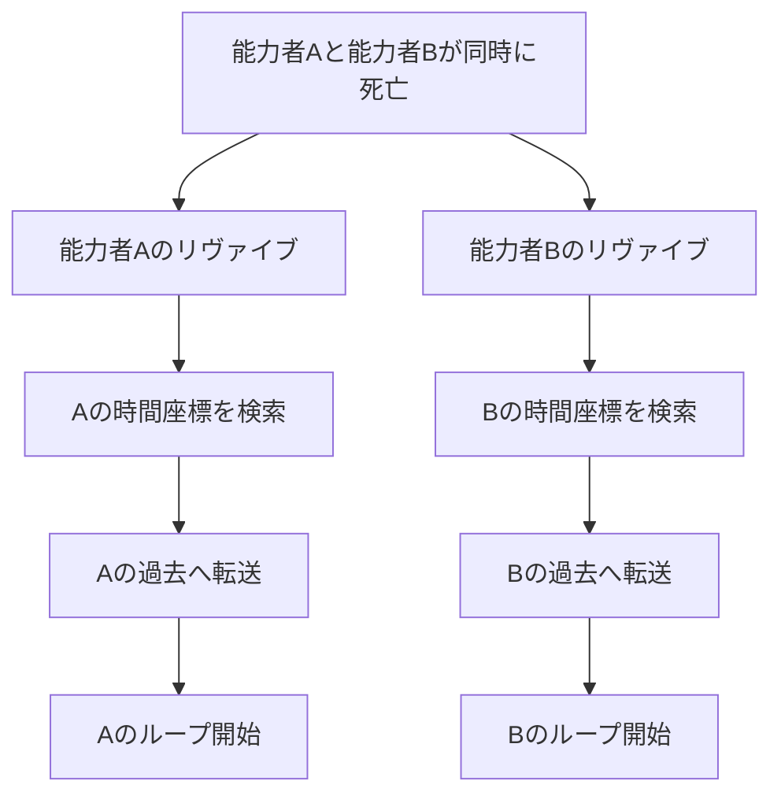
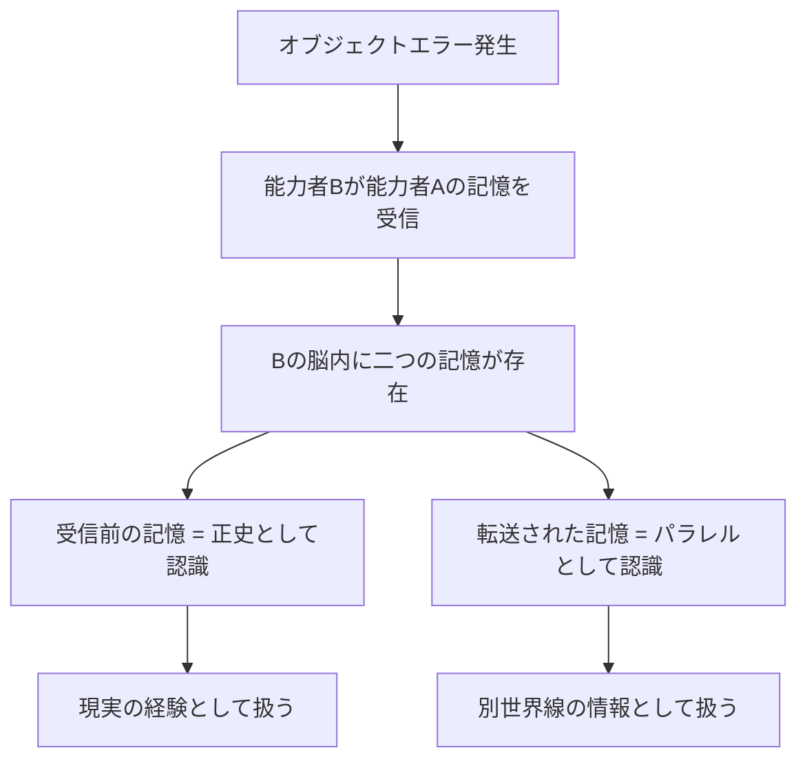
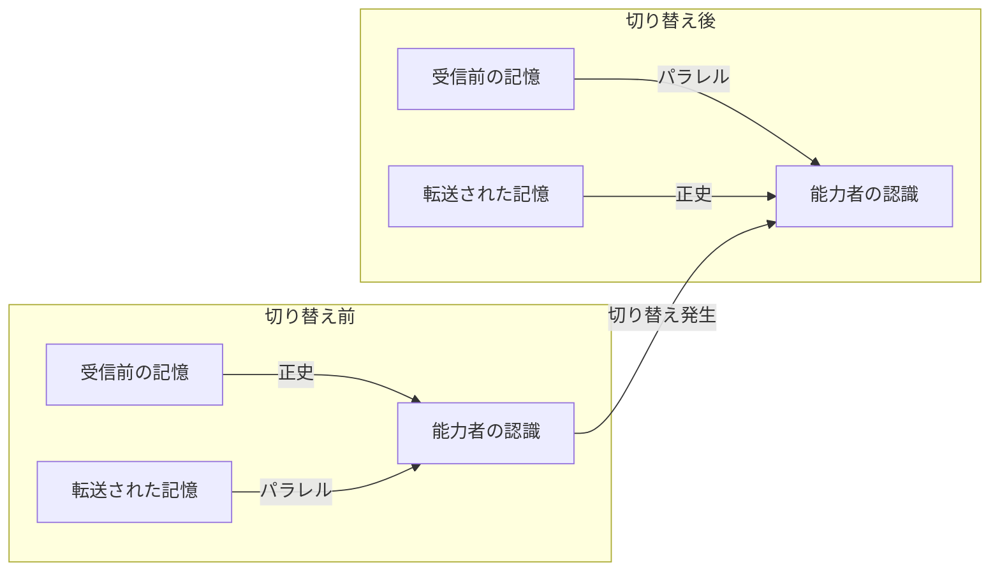
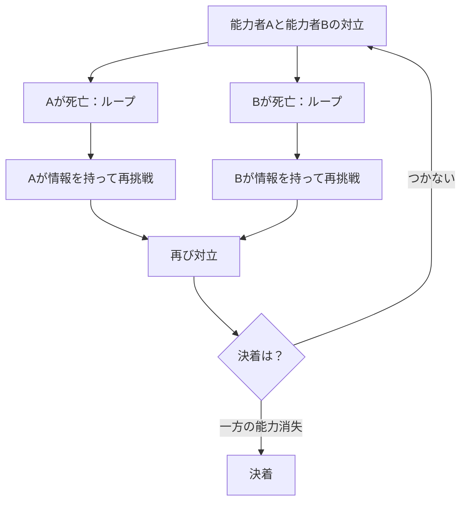

## 第11章：複数能力者のルール

サブジェクトコピーや先天的発現により、リヴァイブ能力者が複数存在する状況が発生しうる。この章では、複数の能力者が同時に存在する場合のルールと相互作用について解説する。

---

### 11.1 同時死亡時の挙動

複数の能力者が同時に死亡した場合、それぞれの能力は独立して発動する。

|項目|内容|
|---|---|
|発動|両者それぞれ発動する|
|優先順位|存在しない|
|判定|各能力者が独立して処理される|
|干渉|互いの転送に影響しない|

---

#### 独立発動の原則

リヴァイブは能力者ごとに完全に独立したシステムとして機能する。「先に死んだ方が優先」「能力歴が長い方が強い」といった階層構造は存在しない。各能力者は自分自身のルールに従って転送を実行し、他の能力者の存在は処理に一切影響しない。

これはテンポラレル（第9章）の構造からも説明できる。各能力者の死亡はそれぞれ異なる管の断絶を引き起こし、それぞれの管に対応するオブスクールムが独立して作動する。複数の管が同時に断絶しても、修復は各管ごとに個別に行われる。

---

#### 戻り先の独立性

|項目|内容|
|---|---|
|同じ時間座標に戻るか|基本的にならない|
|決定要因|各能力者の記憶・感情的刻印・耐久時間による|
|偶然の一致|理論上はありうるが極めて稀|

各能力者の時間座標は、その能力者自身の記憶と感情的刻印に基づいて選定される（第3章）。二人の能力者がまったく同じ感情的刻印を、まったく同じ強度で、まったく同じタイミングに刻んでいる可能性は極めて低い。そのため、同時に死亡しても戻り先が一致することは基本的にない。

これは複数能力者間の情報共有をさらに困難にする要因でもある。同じ出来事を経験していても、戻る先が異なれば、やり直しの起点が異なる。結果として、各能力者は異なる時間軸で異なる行動を取ることになり、時系列は急速に複雑化する。

---

### 11.2 記憶衝突と正史

オブジェクトエラー（第7章）によって能力者間で記憶が転送された場合、受信者の脳内で「二つの記憶」が衝突する。

---

#### パラレル認識

|項目|内容|
|---|---|
|転送された記憶|パラレルワールドのように認識される|
|正史扱い|受信前の記憶が正史|
|切り替え条件|能力者が転送記憶を「自分の経験」と認識した時|
|影響範囲|能力者の主観のみ（世界は変化しない）|

転送された他者の記憶は、受信者の脳内で「別の世界線の出来事」のように認識される。これは脳が自己防衛として、矛盾する情報を分離して処理するためである。自分が体験した記憶と、他者から送られてきた記憶が同じ時間帯の出来事を異なる視点で描いている場合、脳はそれらを「同じ世界の異なる視点」ではなく「異なる世界の出来事」として処理する。

---

#### 正史の切り替え

通常、受信前の記憶が「正史」として扱われる。しかし、特定の条件下で正史の切り替えが発生する。

|段階|状態|
|---|---|
|初期|受信前の記憶 = 正史 / 転送記憶 = パラレル|
|トリガー|能力者が「この記憶どこかで…」と認識する|
|切り替え|転送された記憶が正史に昇格|
|結果|能力者の主観的な「自分の歴史」が変わる|

切り替えは意図的に行えるものではない。能力者が転送記憶を何度も参照し、それを「自分の経験」として感じ始めた時に、脳が自動的に正史ラベルを付け替える。一度切り替わると、元に戻すことは困難である。

---

#### 切り替えの影響

|項目|内容|
|---|---|
|世界への影響|なし（客観的な世界は変化しない）|
|能力者への影響|主観的な正史認識が変わる|
|結果|「自分だけが違う歴史を生きている」という孤独|

正史が切り替わっても、世界は何も変わらない。変わるのは能力者の「自分がどの歴史を生きてきたか」という主観的認識だけである。しかしこの主観の変化は、能力者のアイデンティティに深刻な影響を与える。「本当の自分はどちらの記憶を持つ自分なのか」という問いは、明確な答えを持たない。

---

#### 意図的な記憶送信の不可能性

|項目|内容|
|---|---|
|意図的な送信|不可能|
|発生条件|オブジェクトエラー時のみ|
|制御|できない|

能力者同士であっても、意図的に記憶を送り合うことはできない。記憶の転送はオブジェクトエラーという「事故」によってのみ発生する。これは協力関係を築く上での大きな制約となる。

味方同士であれば情報を共有したいと思うのは当然だが、リヴァイブはそれを許さない。能力者は自分の持つ情報を言葉で伝えることはできても、記憶そのものを直接渡す手段がない。言葉による伝達は不完全であり、信じてもらえないリスクもある。

---

### 複数能力者がもたらす状況

複数の能力者が存在する世界では、単独の能力者では起こりえない複雑な状況が発生する。

|状況|内容|
|---|---|
|時系列の複雑化|各能力者が異なるループを繰り返すことで、時系列が複雑に絡み合う|
|情報の非対称性|ある能力者が知っていることを、別の能力者は知らない|
|戦略的駆け引き|「相手が何回ループしたか分からない」という不確定要素|
|協力の困難さ|意図的な情報共有ができないため、協力が難しい|
|対立の激化|互いの目的が衝突した場合、終わりのない消耗戦になる|

---

#### 情報の非対称性

単独の能力者であれば、自分だけがループの記憶を持ち、周囲は何も知らないという一方的な構図になる。しかし複数の能力者が存在する場合、「相手も何かを知っている」「しかし何を知っているかは分からない」という状況が生まれる。

|能力者Aの視点|能力者Bの視点|
|---|---|
|自分は3回ループした|自分は5回ループした|
|Bが何回ループしたか分からない|Aが何回ループしたか分からない|
|Bが何を知っているか分からない|Aが何を知っているか分からない|
|Bの目的が分からない|Aの目的が分からない|

この非対称性は、複数能力者間の関係を極めて不安定なものにする。信頼を築くには情報の開示が必要だが、開示した情報が正確かどうかを検証する手段がない。相手がループ回数や知っている情報について嘘をついていても、確認しようがない。

---

#### 対立する能力者同士の戦い

互いの目的が衝突する能力者同士が対立した場合、通常の戦いとは根本的に異なる構造の争いが発生する。

|特徴|内容|
|---|---|
|終わりが見えない|一方が死んでもループで戻ってくる|
|情報戦|「相手の行動パターン」を何度も観察できる|
|消耗戦|双方の脳の負荷が累積していく|
|決着条件|一方の能力が消失するまで続く可能性がある|

この構造では、最終的に「先に脳の限界を迎えた方が負ける」という消耗戦になりうる。どちらがより効率的に情報を集め、より少ないループ回数で目的を達成できるかが勝敗を分ける。

---
