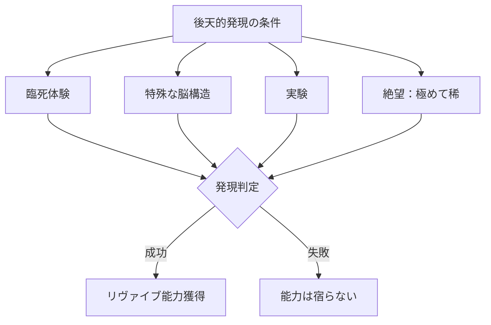
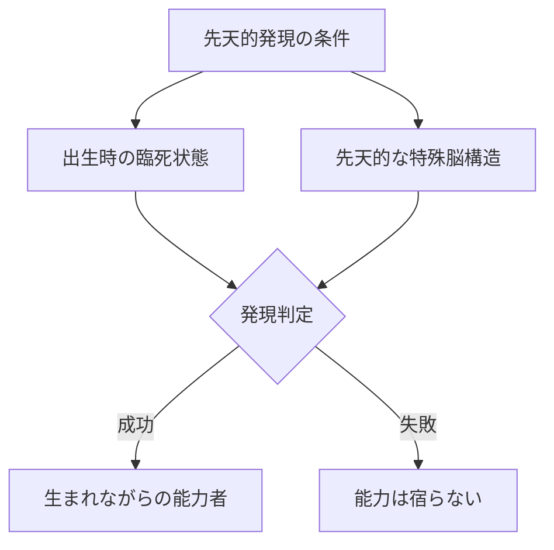
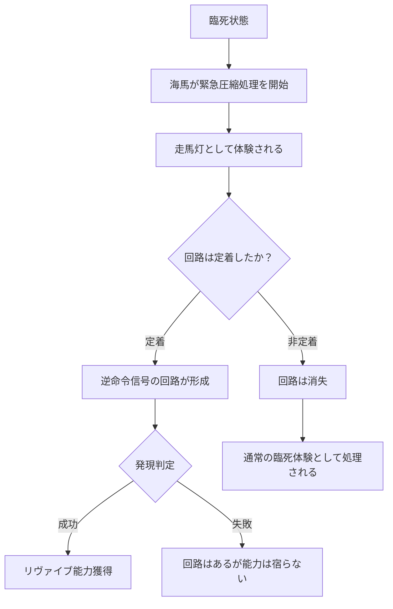
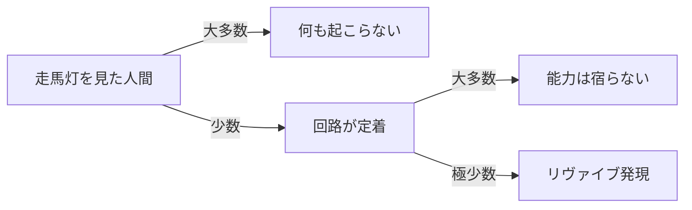
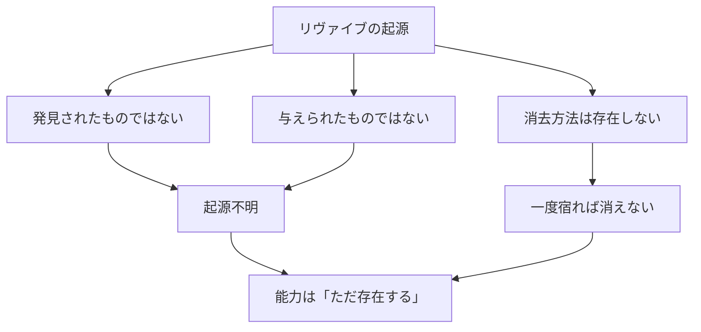

## 第12章：能力の発現条件

リヴァイブはどのようにして発現するのか。この章では、能力が宿る条件とそのパターン、走馬灯との関係、そして能力の起源について解説する。

---

### 12.1 後天的発現

後天的発現は、生まれた後の特定の体験や状況によって能力が宿るパターンである。リヴァイブの発現経路としては最も一般的だが、条件を満たしたからといって必ず発現するわけではない。

|発現条件|内容|
|---|---|
|臨死体験|死の淵から生還した経験|
|特殊な脳構造|先天的または後天的な脳の特異性|
|実験|人為的な介入による発現|
|絶望（稀）|極限の精神状態がトリガーになる|

---

#### 臨死体験

死の直前まで到達し、そこから生還することで能力が発現するケース。脳が「死」を認識し、逆命令信号の回路が形成されると考えられる。

|臨死体験の例|内容|
|---|---|
|事故|交通事故、転落などで生死の境をさまよう|
|病気|重篤な疾病からの回復|
|暴力|殺害されかけて生き延びる|
|溺水|水中で意識を失いかけて救助される|

臨死体験による発現が最も一般的なパターンであるのは、「死の認識」がリヴァイブの起動条件そのものと一致するからだと推測される。死の淵を一度覗いた脳が、逆命令信号の回路を「試しに構築する」ことで、次の死亡時に回路が実際に機能する状態になる。

---

#### 特殊な脳構造

生まれつき、または後天的に脳に特異な構造を持つ者が、何らかのきっかけで能力を発現するケース。

|特殊構造の例|内容|
|---|---|
|海馬の異常発達|記憶処理能力の特異性|
|神経回路の変異|通常とは異なる信号伝達経路|
|脳損傷後の再構築|事故や病気後に脳が再編成される|

脳構造の特異性だけでは発現しない場合が多い。「特殊な脳構造」に加えて、何らかの後天的なトリガー（軽度の臨死体験、強いストレスなど）が加わることで初めて能力が宿る。いわば「発現しやすい素地」を持っている状態であり、素地があっても点火されなければ能力は眠ったままである。

---

#### 実験

人為的な介入によって能力を発現させようとするケース。成功率は低く、倫理的な問題を伴う。

|実験の例|内容|
|---|---|
|人体実験|被験者に意図的に臨死状態を経験させる|
|脳への直接介入|手術や薬物による脳構造の改変|
|極限環境|極度のストレス下に置く|

実験による発現は、臨死体験による自然発現を人工的に再現しようとする試みである。しかし、自然な臨死体験と人為的に作られた臨死状態の間には、何らかの本質的な差異があるのか、単に確率の問題なのかは分かっていない。実験の成功率が低いという事実だけが知られている。

---

#### 絶望

極めて稀なケースとして、絶望的な精神状態がトリガーとなって能力が発現することがある。

|特徴|内容|
|---|---|
|発生頻度|極めて稀|
|条件|精神が完全に追い詰められた状態|
|メカニズム|不明（脳の防衛機制の可能性）|

肉体的な臨死を経験していなくても、精神的に「死んだも同然」の状態に追い込まれた人間が能力を獲得することがある。これは物理的な死の認識ではなく、精神的な死の認識が逆命令信号の回路を形成しうることを示唆している。ただし発生は極めて稀であり、このパターンで発現した事例は確認可能な範囲ではほとんどない。

---

### 12.2 先天的発現

先天的発現は、生まれる前または生まれた瞬間に能力が宿るパターンである。後天的発現よりもさらに稀である。

|発現条件|内容|
|---|---|
|出生時の臨死状態|産声を上げる前に臨死状態を経験|
|先天的な特殊脳構造|生まれつき能力に適合した脳を持つ|

---

#### 出生時の臨死状態

|状況例|内容|
|---|---|
|難産|出産時に酸素供給が途絶える|
|仮死状態での出生|産声を上げる前に心肺停止|
|臍帯の問題|へその緒が首に巻きつくなど|
|早産|未熟な状態での出生による危険|

このパターンでは、赤子が産声を上げる前に一度死の淵に立ち、そこから蘇生することで能力が宿る。本人は当然その記憶を持たないが、能力は確かに存在している。

先天的能力者の特殊な点は、「最初の死」まで自分が能力者であることを知る術がないことである。後天的発現であれば臨死体験などのきっかけを自覚できる場合があるが、先天的能力者は何の前触れもなく、最初の死亡時に突然ループを経験する。

---

#### 先天的な特殊脳構造

出生時の臨死状態を経ていなくても、生まれつき能力に適合した脳構造を持つ者が存在する可能性がある。この場合、成長過程のどこかで何らかのトリガーが加わることで能力が発現する。厳密には「先天的素地＋後天的トリガー」の複合パターンであり、純粋な先天的発現とは言い切れないが、素地が先天的である点で本節に含める。

---

### 12.3 走馬灯と逆命令信号の関係

一般に「走馬灯」と呼ばれる臨死時の現象——死の直前に人生の記憶が高速で再生される体験——は、本設定において「海馬による記憶の緊急圧縮処理」として再解釈される。

|項目|一般的解釈|リヴァイブにおける解釈|
|---|---|---|
|走馬灯の正体|酸素不足による脳のランダムな発火|海馬が記憶の緊急圧縮処理を実行している|
|体験の意味|偶発的な現象、意味はない|逆命令信号の回路が起動した痕跡|

---

#### 走馬灯と能力発現の関係

走馬灯の発生は「逆命令信号の回路が一度起動した」ことを意味する。ただし、回路が起動したことと、回路が定着することは別の現象である。

---

#### 発現に至らないケース

走馬灯が見えた（＝圧縮処理が走った）にもかかわらず能力が発現しないケースは、複数の段階で脱落が起こりうることを意味する。

|段階|内容|脱落する場合|
|---|---|---|
|第1段階|海馬が圧縮処理を開始する|走馬灯として体験される（ここまでは到達）|
|第2段階|逆命令信号の回路が形成される|一度の起動では回路が定着しない場合がある|
|第3段階|回路が能力として機能する|回路が形成されても、能力として宿るとは限らない|

---

#### 脱落の要因（推測）

|要因|内容|
|---|---|
|脳の個体差|神経可塑性の高さは個人によって異なる|
|臨死の深度|死にどこまで近づいたかで圧縮処理の完了度が変わる|
|時間的猶予|圧縮処理が完了する前に蘇生されると回路が未完成のまま残る|
|不明因子|上記で説明できないケースも存在する|

---

#### 走馬灯を見た非能力者

走馬灯を見たが能力を獲得しなかった人間は、世界に無数に存在する。彼らは「死の間際に不思議な体験をした」と語るが、それ以上のことは起こらない。

|状態|人数|備考|
|---|---|---|
|走馬灯を見た|多数|臨死体験者の報告として広く存在する|
|回路が一時的に起動した|不明|本人にも確認する手段がない|
|回路が定着した|極少数|定着しても能力発現に至らないケースあり|
|能力が発現した|極めて稀|リヴァイブ能力者|

---

#### 重要な注意

走馬灯と逆命令信号の関係はあくまで「再解釈」であり、作中で確定的な事実として扱うかどうかは作品による。本資料の設計思想に従い、能力の起源を安易に確定させないことを推奨する。

|扱い方|効果|
|---|---|
|確定事実として描く|メカニズムが明確になる。ミステリー要素は減る|
|仮説として描く|「本当にそうなのか？」という謎が残る。探求の余地がある|
|言及しない|走馬灯は走馬灯のままで、読者の想像に委ねる|

---

### 12.4 能力の起源に関する事実

|項目|内容|
|---|---|
|発見|されていない（能力は「発見」されたものではない）|
|付与|されていない（誰かに「与えられた」ものではない）|
|消去方法|存在しない（意図的に消すことは不可能）|

リヴァイブは誰かが作り出したものでも、どこかから与えられたものでもない。それは単に「存在する」のであり、特定の条件を満たした者に宿る。能力の究極的な起源は不明であり、それを解明しようとする試みは全て失敗に終わっている。

---

#### 起源に関する事実の整理

|確定していること|確定していないこと|
|---|---|
|特定の条件で宿る|なぜその条件なのか|
|意図的に消せない|なぜ消せないのか|
|サブジェクトコピーで伝播する|なぜ伝播する仕組みがあるのか|
|走馬灯と関係がある可能性|関係の正確な性質|
|テンポラレルと同時に作動する|両者の正確な関係性|

---

#### 発現条件まとめ

|タイプ|条件|確実性|備考|
|---|---|---|---|
|後天的|臨死体験|不確実|最も一般的なパターン|
|後天的|特殊な脳構造|不確実|先天的構造 + 後天的トリガー|
|後天的|実験|不確実|倫理的問題あり|
|後天的|絶望|極めて稀|トリガーのメカニズム不明|
|先天的|出生時臨死|不確実|本人に記憶なし|
|先天的|先天的脳構造|不確実|生まれつきの適合性|

全てのパターンに共通するのは「不確実」であるという点である。条件を満たしても能力が宿るとは限らない。この不確実性は、リヴァイブが完全に理解可能なシステムではないことを示している。起源が不明であるように、発現の最終的な判定基準もまた不明である。

---
