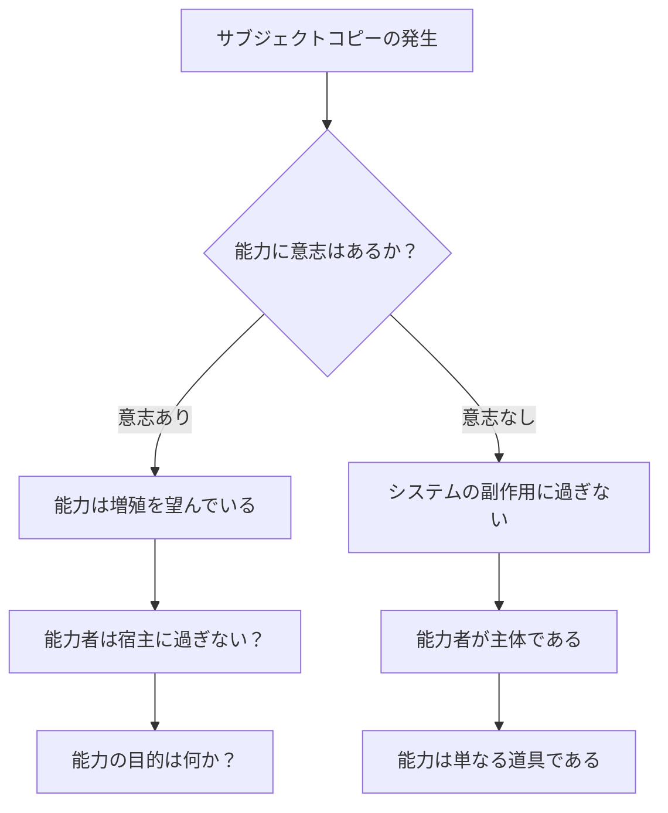
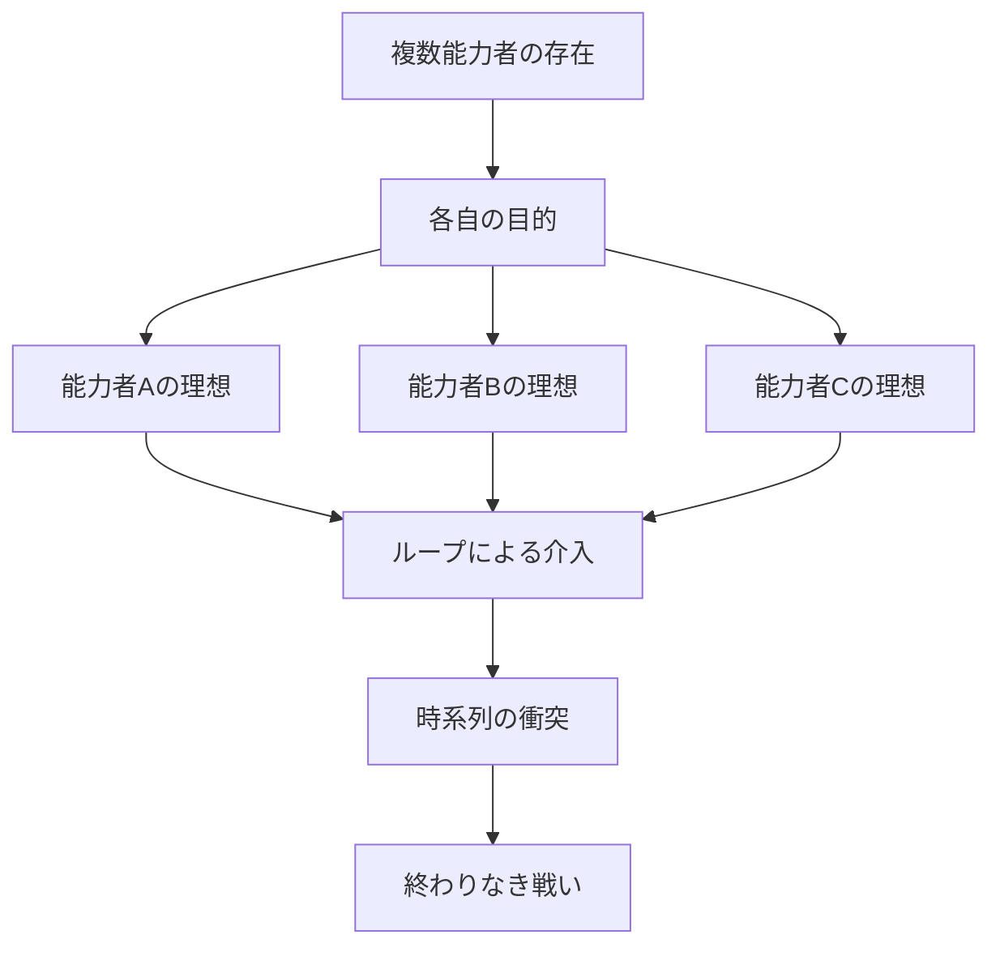

## 第13章：考察

リヴァイブという能力は、単なる「死に戻り」を超えた多くの問いを提起する。この章では、能力の起源、倫理的問題、そして物語的可能性について考察する。

---

### 能力の起源

リヴァイブは「発見」されたものでも「与えられた」ものでもない。それは条件を満たした者に宿る、起源不明の現象である。この事実は、いくつかの根本的な問いを生む。

|問い|内容|
|---|---|
|創造者の存在|誰が、何のために最初の能力者を生み出したのか？|
|能力の意志|能力自体に意志があるのか？|
|増殖の意味|サブジェクトコピーは「増殖本能」なのか？|
|目的|リヴァイブは何のために存在するのか？|

---

#### 創造者仮説

|仮説|内容|
|---|---|
|超自然的存在|神や高次元存在による創造|
|未来からの介入|未来の人類による過去への干渉|
|自然発生|進化の過程で偶発的に生まれた能力|
|集合的無意識|人類の「死を超えたい」という願望の具現化|

いずれの仮説も証明されておらず、能力の起源は謎のままである。本資料はこの謎を意図的に残している。起源を確定させることは設定の奥行きを狭めるからだ。「答えがない」こと自体が、この設定の特性の一つである。

---

#### 能力の意志

サブジェクトコピー（第7章）の存在は、リヴァイブが単なる「道具」ではない可能性を示唆している。

転送データに能力のプログラムが含まれることは、情報転送の機能としては不要である。記憶と感覚を送るだけなら、能力のプログラムまで同梱する必要はない。にもかかわらず含まれているのはなぜか。

|解釈|内容|示唆すること|
|---|---|---|
|意志あり|能力は増殖を望んでいる|能力者は「宿主」に過ぎない可能性|
|意志なし|システムの副作用に過ぎない|能力者が主体であり、能力は道具である|

この問いに正解はない。しかし物語においては、どちらの解釈を採用するかによって作品の方向性が大きく変わる。能力に意志があるなら、物語は「能力からの解放」を描くことになる。意志がないなら、物語は「能力を持つ人間の選択」を描くことになる。

---

### 倫理的問題

リヴァイブの使用は、深刻な倫理的問題を伴う。

---

#### 消えた人々の問題

ループによって巻き戻された時間の中で、人々は確かに生き、行動し、死んだ。しかし、その時間軸は「なかったこと」になる。

|問い|内容|
|---|---|
|存在の消滅|巻き戻された時間軸の人々は「存在した」のか？|
|記憶の価値|能力者だけが覚えている死に、意味はあるか？|
|救済の選択|誰を救い、誰を「消す」かを決める権利は？|

能力者がループするたび、巻き戻された時間軸にいた人々は「存在しなかったこと」になる。彼らは笑い、泣き、怒り、生きていた。しかし、その全てが消える。能力者の記憶の中にだけ残り、それ以外のどこにも証拠がない。

テンポラレル（第9章）の観点からは、不変の時間に痕跡が残るため「完全に消えた」とは言えない。しかし、その痕跡にアクセスできる者はおらず、実質的に「なかったこと」と変わらない。

---

#### 精神の変質

100回死んだ人間は、まだ人間か。ループを繰り返すことで、能力者の精神は確実に変質していく。

|段階|変質の内容|
|---|---|
|初期|死への恐怖、生への執着|
|中期|死への慣れ、感覚の麻痺|
|後期|他者の死への無関心、人間性の希薄化|
|末期|自分が「人間」かどうかの疑問|

第8章で解説した累積効果は、単なる「副作用」ではない。それは能力者の人格そのものを書き換えていくプロセスである。初めてループした時に「もう二度とあんな思いはしたくない」と震えていた人間が、50回目のループでは「また死んだか」と淡々と受け止めるようになる。この変化は適応なのか、それとも人間性の喪失なのか。

---

#### 責任と孤独

能力者は「やり直せる」がゆえに、全ての結果に対する責任を負う。

|側面|内容|
|---|---|
|無限の責任|「やり直せたはず」という自責|
|共有不能|ループの苦しみを理解する者がいない|
|信頼の困難|何度も同じ人を見てきたことで生じる歪み|
|人間関係の崩壊|主観時間のズレによる乖離|

通常の人間であれば、失敗は「仕方なかった」で済ませられることがある。しかしリヴァイブの能力者には「やり直せた」という事実がある。誰かが死んだとき、「もう一度ループすれば救えたかもしれない」という可能性が常に存在する。この可能性は、能力者を永遠に自責の中に閉じ込める。

そしてこの苦しみを、誰にも説明できない。ループの存在を打ち明けたところで、相手にとっては「初めて聞く話」である。能力者が何十回ものループで積み上げた疲労と悲しみは、言葉だけでは到底伝わらない。

---

### 物語的可能性

リヴァイブの設定は、多様な物語展開を可能にする。

---

#### 複数能力者による時系列戦争

サブジェクトコピーによって能力者が増えた世界では、各能力者が自分の目的のためにループを繰り返す。それぞれが異なる「理想の結末」を目指すとき、時系列そのものが戦場となる。

|展開要素|内容|
|---|---|
|目的の衝突|各能力者が異なる結末を望む|
|情報戦|何度も繰り返すことで相手の行動パターンを学習する|
|消耗の非対称|能力の累積負荷に差がある|
|決着|一方の能力消失、あるいは妥協による和解|

---

#### オブジェクトエラーによる同盟と対立

意図せず他者に記憶が転送されることで、予期せぬ関係性が生まれる。

|パターン|展開|
|---|---|
|敵への転送|能力者の弱点が露見、致命的不利に|
|味方への転送|言葉を超えた理解、強固な絆の形成|
|無関係者への転送|新たな協力者、または新たな敵の誕生|
|相互転送|互いの記憶を持つ者同士の複雑な関係|

オブジェクトエラーが制御不能であることが、この展開を特に興味深くする。能力者は「誰に記憶が送られるか」を選べない。最も知られたくない相手に、最も知られたくない情報が渡る可能性がある。逆に、長年伝えられなかった想いが、事故的に伝わることもある。

---

#### 起源を探す旅

「最初のループ者」は誰か。能力はどこから来たのか。この謎を追う旅は、世界の真実に迫る物語となりうる。

|探求の段階|内容|
|---|---|
|発端|自分の能力の起源への疑問|
|調査|他の能力者、過去の記録を探す|
|発見|最初の能力者の痕跡|
|真実|能力の本当の意味と目的|

この物語類型は、第12章で解説した「起源の不明性」と直結する。本資料が起源を意図的に不明としているのは、この類型の物語を可能にするためでもある。起源が最初から確定していれば、「探す物語」は成立しない。

---

#### 能力をめぐる陰謀

リヴァイブの存在を知る組織があるとすれば、彼らは能力者を利用しようとするだろう。

|勢力|目的|
|---|---|
|研究機関|能力の解明と人工的再現|
|政府・軍|能力者の兵器化|
|宗教組織|能力の神聖化または悪魔化|
|能力者集団|能力者による支配または保護|

能力者の「死んでも戻れる」という特性は、軍事的に見れば究極の偵察能力であり、情報収集能力であり、試行錯誤が可能な最強の工作員である。しかし同時に、能力者は脳の負荷という明確な弱点を持ち、不意打ちで殺せば情報を渡さずに済む。能力者をめぐる争奪戦は、能力の強みと弱みの両方を知る者同士の高度な駆け引きになる。

---

### 結語

リヴァイブは、死を超える力であると同時に、死に縛られる呪いでもある。

能力者は何度でもやり直せる。しかし、やり直すたびに何かを失っていく。記憶、感覚、人間性、そして「本当の死」への恐怖。無限に見えて有限。救済に見えて呪縛。それがリヴァイブの本質である。

この設定は、論理的整合性と物語的緊張感を両立させたシステムである。しかし同時に、答えの出ない問いを内包した、開かれた設定でもある。テンポラレルの起源、能力の意志、消えた人々の存在。これらの問いは、本資料の中では答えを出さない。

その問いに答えを出すのは、この能力を持つ者の物語である。

---
