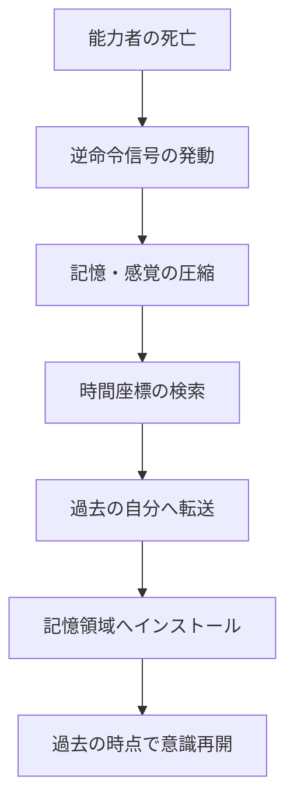

## 第1章：概要

リヴァイブ（Re:vive）は、死亡時に過去の特定時点へ記憶と感覚を転送する能力である。

物理的な時間移動ではない。肉体が過去へ運ばれるのではなく、死の瞬間に脳が発する「逆命令信号」によって、記憶と身体感覚が圧縮され、過去の自分へ送信される。過去の自分の記憶領域にデータが上書きされることで、能力者は「戻った」と認識する。本質的にはバックアップデータのインストールである。

単純なタイムループとも異なる。リヴァイブは生物学的・物理的メカニズムに基づいた情報転送システムとして機能する。発動には死亡という絶対的なトリガーが必要であり、生存中に意図的に起動することはできない。

この能力は回数制限を持たない。しかし、使用するたびに脳への負荷が累積し、能力者の記憶・感覚・人格を蝕んでいく。やがて脳が限界を迎えた時、能力は永久に失われる。

無限に見えて有限。救済に見えて呪縛。チートに見えて代償がある。それがリヴァイブの本質である。

---

### 基本情報

| 項目    | 内容                                            |
| ----- | --------------------------------------------- |
| 正式名称  | リヴァイブ（Re:vive）                                |
| 語源    | Reverse（逆行）+ Dive（潜行）の造語。Revive（蘇生）との二重の意味を持つ |
| 分類    | 情報転送型時間逆行能力                                   |
| 発動条件  | 能力保有者の死亡                                      |
| 転送対象  | 記憶および身体感覚                                     |
| 転送先   | 過去の自分（原則）                                     |
| 物理移動  | なし（情報の上書きのみ）                                  |
| 回数制限  | なし（ただし累積負荷あり）                                 |
| 能力の終焉 | 脳の過負荷による消失                                    |

---

### 発動から転送完了までの流れ

---

### 設計思想

リヴァイブは以下の三原則に基づいて設計されている。

|原則|内容|
|---|---|
|無限に見えて有限である|回数制限はないが、脳の負荷累積により確実に終わりが来る|
|救済に見えて呪縛である|やり直せる力は、やり直さなければならない責任と孤独を生む|
|使うほど追い詰められる|ループを重ねるほど記憶は混濁し、身体は蝕まれ、人間性が摩耗する|

---

### この資料の読み方

本資料は第2章以降で以下の順序に従ってリヴァイブの全容を解説する。

| 部                  | 扱う問い                                  |
| ------------------ | ------------------------------------- |
| 第1部：基礎（第1〜2章）      | この能力は何か。どう起動するか                       |
| 第2部：転送の仕組み（第3〜5章）  | 何が、どこへ、どう送られ、受け取った側に何が起こるか            |
| 第3部：転送の不完全性（第6〜7章） | 完璧には送れない。何が失われ、何が歪み、何が事故を起こすか         |
| 第4部：代償（第8章）        | 使うほど壊れていく。何が蓄積し、どう終わるか                |
| 第5部：世界への波及（第9〜11章） | 能力者の外側に何が起こるか。時間の構造、非能力者への影響、複数能力者の世界 |
| 第6部：起源と思索（第12〜13章） | なぜこの能力は存在するのか。どこから来たのか                |
| 付録（A〜G）            | 用語集、数値一覧、制約一覧、フローチャート、活用ガイド等          |

---
