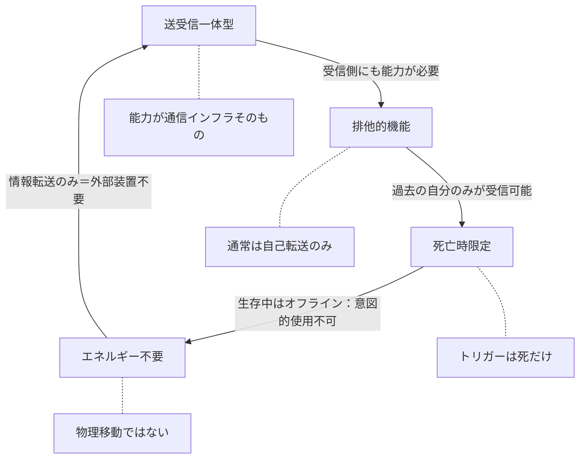

## 第2章：基本メカニズム

リヴァイブは死亡をトリガーとして起動する情報転送システムである。この章では発動から転送完了までの基本的な流れと、能力の根本的な特性を解説する。

---

### 2.1 発動条件

リヴァイブは以下の5ステップで発動する。

|ステップ|プロセス|内容|
|---|---|---|
|1|死亡検知|能力保有者が死亡する|
|2|逆命令信号|海馬から逆命令信号が発せられる|
|3|覚醒維持|脳が一時的な覚醒状態を維持する|
|4|座標検索|記憶から適切な時間座標を検索・確定する|
|5|転送実行|時間ジャンプが発動し、過去へ転送される|

---

#### 逆命令信号とは

逆命令信号は、通常の死亡プロセスとは逆方向に脳を活性化させる特殊な信号である。

通常、死亡時の脳は機能を停止していく。心停止、酸素供給の途絶、神経活動の減衰、そして意識の消失。逆命令信号はこの流れに逆らい、死にゆく脳を一時的に再活性化させる。この信号により、脳幹が破壊されていても海馬が無事であれば緊急タスクとして転送処理が優先実行される。なお、海馬を含む脳全体が破壊された場合は通常の転送処理が実行できず、エマージェンシーコネクション（第7章）に移行する。

ただし、この一時的な再活性化は転送処理を完了させるためだけのものであり、能力者を「生き返らせる」わけではない。転送が完了すれば、その時間軸における脳は完全に機能を停止する。

---

#### 各ステップの詳細

**ステップ1：死亡検知**

能力の起点は死亡そのものである。心停止、脳死、外傷による即死など、死因の種類は問わない。ただし、死を「認識」できるかどうかによって後続の転送品質が大きく変わる（詳細は第7章で解説する）。

**ステップ2：逆命令信号**

海馬が死亡を検知した瞬間、逆命令信号を発する。この信号が全プロセスの起点となる。逆命令信号が正常に発動しなければ、以降のステップは一切実行されない。

**ステップ3：覚醒維持**

逆命令信号を受けた脳は、死に向かう通常プロセスを一時停止し、転送タスクに全リソースを割り当てる。この状態は極めて短時間（数秒〜最大120秒）しか維持できない。

**ステップ4：座標検索**

脳が覚醒を維持している間に、記憶の中から最適な転送先（時間座標）を自動検索する。選定ロジックの詳細は第3章で解説する。

**ステップ5：転送実行**

時間座標が確定すると、記憶と感覚データが圧縮され、過去の自分へ転送される。転送が完了した時点で、現在の時間軸における能力者の脳は完全に停止する。

---

### 2.2 重要な特性

リヴァイブには4つの根本的な特性がある。これらはあらゆる状況において例外なく適用される。

|特性|名称|内容|
|---|---|---|
|特性1|送受信一体型|能力自体に送信機能と受信機能が組み込まれている|
|特性2|死亡時限定|死んだタイミングでのみオンライン状態になる|
|特性3|排他的機能|能力保有者（過去の自分）への転送が原則|
|特性4|エネルギー不要|物理移動ではなく情報の上書き|

---

#### 送受信一体型

リヴァイブは外部装置を必要としない。能力そのものが送信機と受信機の両方を兼ねている。

これが成立する理由は単純である。過去の自分も同じ能力を保有しているからだ。送信側（死亡時の自分）が能力を使ってデータを送り、受信側（過去の自分）が同じ能力を通じてデータを受け取る。能力が送信機であり受信機であり、通信プロトコルでもある。

|項目|内容|
|---|---|
|送信側|死亡時の自分（能力が送信機として機能）|
|受信側|過去の自分（能力が受信機として機能）|
|通信経路|能力そのもの（外部装置不要）|
|前提条件|受信側も同じ能力を保有していること|

---

#### 死亡時限定

生存中、リヴァイブは完全にオフライン状態となる。能力者がどれだけ強く望んでも、生きている間は能力に一切アクセスできない。

|状態|能力|
|---|---|
|生存中|完全オフライン。検知不可・発動不可・部分起動不可|
|死亡の瞬間|オンライン化。逆命令信号が発動し転送プロセスが開始|
|転送完了後|再びオフライン（過去の時点で通常の生活に戻る）|

意図的な発動は不可能である。「少しだけ過去を覗く」「記憶だけ先に送っておく」といった部分的な使用もできない。死亡という絶対的なトリガーによってのみ起動する。

---

#### 排他的機能

通常、転送先は能力保有者自身（過去の自分）に限定される。他者への転送は原則として行われない。

|転送先|条件|
|---|---|
|過去の自分|通常時（原則）|
|他者|オブジェクトエラー発生時のみ（制御不能な事故）|

この排他性は能力の構造に由来する。受信側にも同じ能力が必要であり、通常それを満たすのは過去の自分だけだからである。ただし、オブジェクトエラー（第7章で解説）発生時にはこの制限が破られ、他者に記憶が送信されることがある。

---

#### エネルギー不要

リヴァイブは肉体を過去へ運ぶのではない。転送されるのは記憶と感覚という「情報」だけである。

物理的な質量を時間軸上で移動させるには莫大なエネルギーが必要になる。しかし、リヴァイブは情報の上書きとして処理されるため、そのようなエネルギーを必要としない。過去の自分の記憶領域に新しいデータを書き込む——本質的にはそれだけのことである。

|比較対象|処理内容|エネルギー|
|---|---|---|
|物理的タイムトラベル|質量を時間軸上で移動|膨大（理論上不可能に近い）|
|リヴァイブ|情報を過去の記憶領域に上書き|不要（バックアップのインストール）|

---

#### 4つの特性の相互関係

4つの特性は独立しているように見えて、互いに支え合っている。送受信一体型だから受信側にも能力が必要であり（→排他的機能）、死亡時にしか起動しないからこそ「使い放題」にならず（→死亡時限定）、情報転送だからこそ物理的制約を回避でき（→エネルギー不要）、情報転送のみで外部装置が不要だからこそ能力単体で完結する（→送受信一体型）。この構造全体が、リヴァイブを「チートに見えてチートではない能力」にしている。

---
