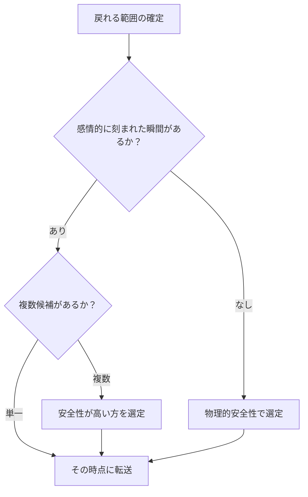
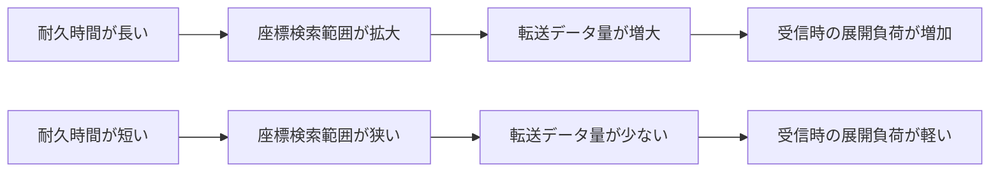
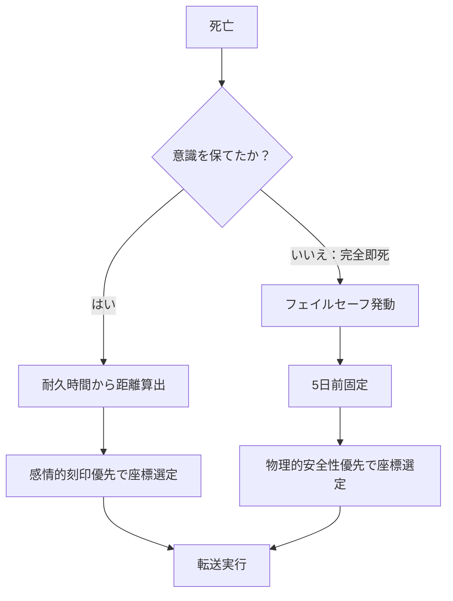

## 第3章：時間座標システム

リヴァイブにおいて「どの時点に戻るか」は自動的に決定される。能力者が任意でセーブポイントを設定することはできない。この章では、戻り先を決定するロジック、戻れる距離の算出方法、そして完全即死時のフェイルセーフについて解説する。

---

### 3.1 選定ロジック

時間座標の選定には明確な優先順位が存在する。

|優先順位|選定基準|内容|
|---|---|---|
|1|感情的刻印|感情的に強く刻まれた瞬間|
|2|物理的安全性|転送直後に再度死亡するリスクが低い場所|

能力は「戻れる範囲」の中から、まず感情的に強く刻まれた瞬間を探索する。該当する地点が複数ある場合、または感情的刻印が弱い場合は、物理的安全性が高い場所が選択される。



---

#### 感情的刻印とは

強い感情を伴って記憶に深く刻まれた瞬間を指す。リヴァイブはこの「刻印の深さ」を検出し、転送先候補として優先的に抽出する。

|感情の種類|例|
|---|---|
|強い喜び|大切な人との再会、目標の達成|
|深い悲しみ|喪失の瞬間、別れ|
|恐怖|生命の危機を感じた瞬間|
|怒り|強い憤りを感じた出来事|
|決意|重要な覚悟を決めた瞬間|

感情的刻印が優先される理由は明確に解明されていない。一つの仮説として、感情が強い記憶ほど海馬に深く刻まれるため、時間座標検索において「見つかりやすい」のではないかと推測される。

---

#### 物理的安全性とは

転送直後に能力者が再び死亡するリスクが低い状況を指す。感情的刻印が存在しない場合、または複数の候補間で優劣をつける場合に、この基準が適用される。

|安全性の判定要素|内容|
|---|---|
|周囲の脅威|敵や危険な存在がいないこと|
|身体の安定|座っている、横になっているなど安定した姿勢|
|逃走経路|緊急時に逃げられる環境|
|環境の安全|崖の上、水中、火災現場などでないこと|

---

#### 能力者の介入余地

|項目|可否|
|---|---|
|戻り先の指定|不可能|
|感情的刻印の意図的な作成|不可能（意図して「強い感情」を作ることはできない）|
|選定結果の拒否|不可能|
|選定結果の事前確認|不可能|

能力者は戻り先に一切介入できない。「ここに戻りたい」という意志は選定に影響せず、能力が自動的に決定した地点を受け入れるしかない。これはリヴァイブの大きな制約の一つである。

---

### 3.2 耐久時間と距離

戻れる距離は、死亡時に能力者が意識を保っていた時間によって決定される。

---

#### 基本公式

```
戻れる距離（日数） = 耐久時間（秒） ÷ 10
```

|耐久時間|戻れる距離|
|---|---|
|10秒|1日前|
|20秒|2日前|
|30秒|3日前|
|60秒|6日前|
|90秒|9日前|
|120秒|12日前（上限）|

---

#### 耐久時間とは

死の瞬間から意識が完全に途絶えるまでの時間である。致命傷を負ってから脳が活動を停止するまでの間、能力者が「自分は死にゆく」と認識し続けている時間と言い換えてもよい。

この時間が長いほど、座標検索の範囲が広がり、より遠い過去に戻ることが可能になる。

---

#### 上限：120秒

人間が死の淵で意識を保てる限界は120秒である。これは人体の生理的な限界であり、能力とは無関係に決定されている。どれだけ精神力が強くても、どれだけ訓練しても、120秒を超えることは生理的に不可能である。

したがって、リヴァイブで戻れる最大距離は12日前となる。

---

#### 耐久時間と負荷の関係

長く意識を保つことにはメリットとデメリットの両面がある。

|耐久時間|メリット|デメリット|
|---|---|---|
|短い（10〜30秒）|受信時の脳への負荷が軽い|戻れる距離が近い（1〜3日前）|
|長い（60〜120秒）|より遠い過去に戻れる|データ圧縮に時間がかかり、転送データ量が増大し、受信時の展開負荷が重い|

長く意識を保てば保つほど、座標検索の範囲が広がりデータ量も増加する。その結果、受信側（過去の自分）がデータを展開する際の脳への負荷が増大する。「遠くに戻る」ことと「安全に戻る」ことはトレードオフの関係にある。



---

### 3.3 完全即死時の挙動

意識を保つ時間が0秒——すなわち完全即死の場合は、通常の選定ロジックが適用できない。この時、特殊なフェイルセーフが作動する。

---

#### フェイルセーフの仕様

|項目|内容|
|---|---|
|発動条件|耐久時間が0秒（完全即死）|
|戻れる距離|5日前（固定値）|
|選定基準|物理的安全性が最優先|
|感情的刻印|適用されない|

通常の選定ロジックでは感情的刻印が第一優先だが、完全即死時は「意識による選択」そのものが不可能である。能力者が死を認識する間もなく即死しているため、座標検索を能力者の意識が介在する形では実行できない。フェイルセーフはこの状況に対し、能力が独立して安全な地点を自動選択する。



---

#### 5日前固定の意味

完全即死という最悪の状況でも、最低限の「やり直し期間」が保証される。5日間あれば、状況の把握と再行動に必要な時間は確保できる。

ただし、戻り先は能力者の意図と完全に無関係に決定される。フェイルセーフは「安全な場所」を選ぶが、それが能力者にとって「都合の良い場所」であるとは限らない。

|保証されること|保証されないこと|
|---|---|
|5日間の猶予|戻り先の都合の良さ|
|物理的に安全な地点|感情的に望ましい地点|
|最低限のやり直し期間|死因の情報（即死のため記憶なし）|

---

#### 戦略的考察

完全即死は一見すると最悪の死に方だが、一定の利点も存在する。

|観点|内容|
|---|---|
|利点|「5日前・安全な場所」という固定値が保証される。不確定要素がない|
|欠点|感情的刻印による有利な地点への転送を放棄する。死因の情報も得られない|
|戦略的選択|状況によっては意図的に即死を選ぶことで、確実に5日前の安全地点に戻る戦略が成立しうる|

ただし、この戦略には重大なリスクがある。即死を選んだ場合、コンプレッションセンス（第4章で解説）による感覚転送も最小限となり、前回の死に方に関する情報がほぼ得られない。「何から逃げるべきか分からないまま5日前に戻る」ことになる。

---
