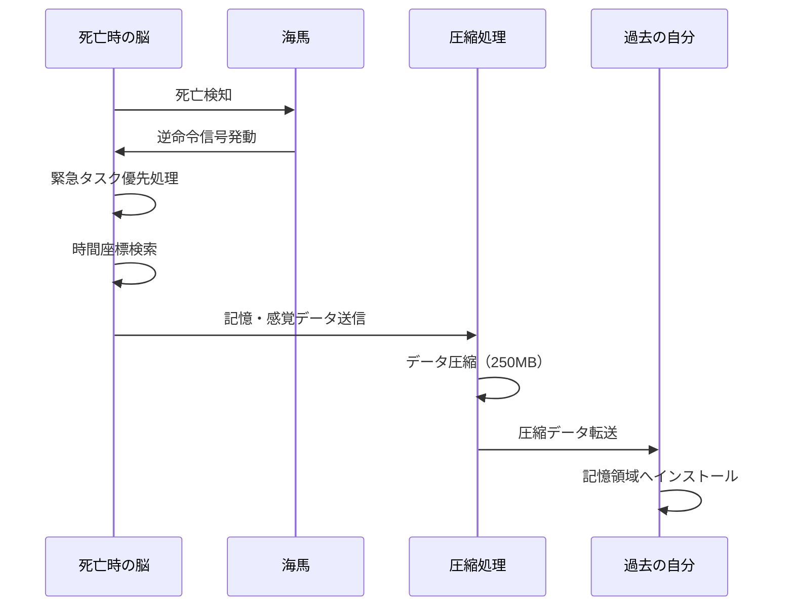
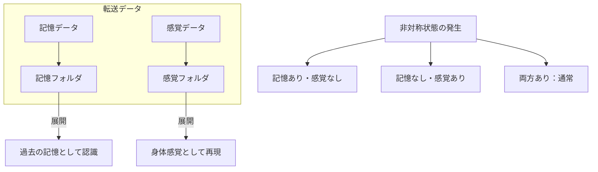
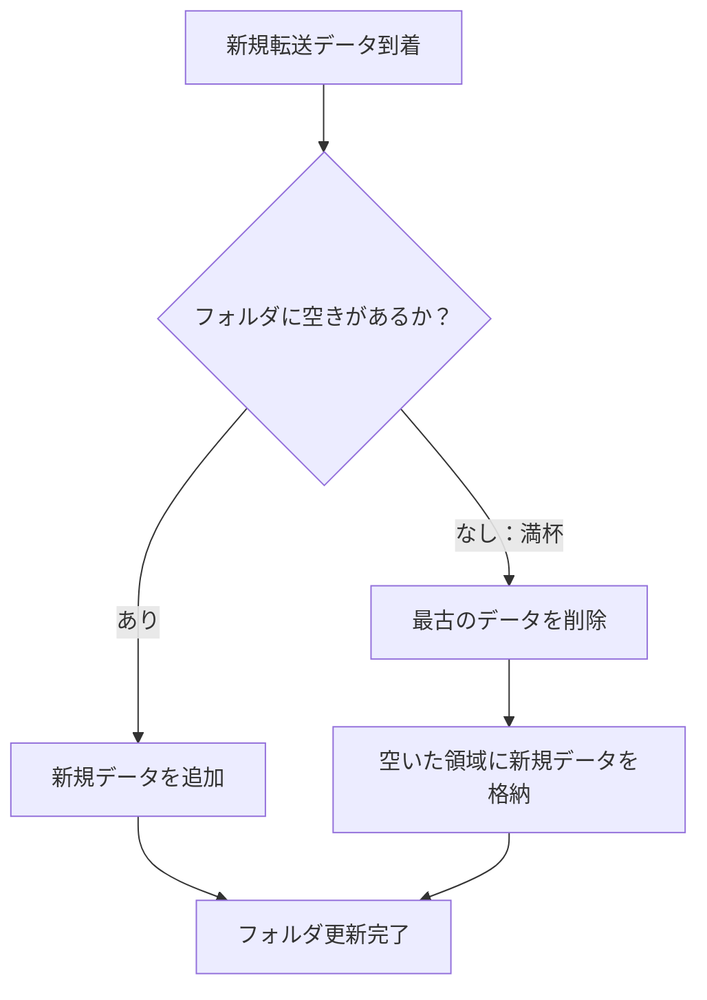

## 第4章：転送データ

リヴァイブの核心は「何を」「どのように」転送するかにある。この章では、転送されるデータの種類、感覚の圧縮メカニズム、そして格納システムについて解説する。

---

### 4.1 通常転送

通常転送では、記憶と感覚の両方が圧縮されて過去の自分へ送信される。

|項目|内容|
|---|---|
|転送データ|記憶 + 感覚|
|記憶容量|約250MB（圧縮状態）|
|記憶内容|約5分間の記憶（圧縮換算）|
|感覚データ|痛み、恐怖などの身体感覚|

---

#### 転送プロセス

|ステップ|処理内容|
|---|---|
|1|死亡を検知、海馬の逆命令信号が発動|
|2|脳が緊急タスクとして優先処理を開始|
|3|記憶から最適な時間座標を自動検索|
|4|記憶・感覚データを圧縮|
|5|転送を実行|
|6|過去の自分の記憶領域へインストール|

---

#### 転送容量について

約250MBという容量は「約5分間の記憶」に相当する。これは死亡直前の5分間という意味ではなく、圧縮処理された結果の総データ量が250MB相当になるということである。

感情的に強い記憶は圧縮効率が高く、より多くの情報が含まれやすい。逆に、曖昧な記憶や反復的な記憶は圧縮率が低く、実質的に含まれる情報量が減る。

---

#### 脳幹破壊時の処理

通常、脳幹が破壊されると生命維持が不可能になる。しかしリヴァイブでは、逆命令信号が発動した瞬間から転送完了までの極めて短い時間、脳が緊急タスクとして処理を継続する。

|状況|転送の成否|
|---|---|
|脳幹破壊だが海馬は無事|転送可能（ただし時間的猶予が極めて短い）|
|脳幹・海馬ともに破壊（脳全体の破壊を含む）|通常転送は不可能。エマージェンシーコネクション（第7章）に移行|

脳幹が破壊されても、海馬が逆命令信号を発するだけの時間が確保できれば、通常転送は成立する。ただし処理時間が極端に短くなるため、転送データの品質は低下しやすい（情報欠落・情報劣化については第6章で解説する）。

---

### 4.2 コンプレッションセンス

コンプレッションセンス（Compression Sense）は、身体感覚を圧縮して転送する専用サブシステムである。記憶とは独立して動作し、独自の格納先を持つ。

|項目|内容|
|---|---|
|正式名称|コンプレッションセンス（圧縮感覚転送）|
|対象データ|痛み、恐怖、吐き気などの身体感覚|
|格納先|感覚フォルダ（記憶フォルダとは独立）|
|圧縮率|高圧縮（受信時に瞬時に体感として再現される）|

---

#### 転送される感覚の例

|感覚種別|具体例|
|---|---|
|痛覚|刺傷、銃創、身体欠損の痛み|
|恐怖|死の瞬間の恐怖、絶望感|
|生理反応|吐き気、嘔吐、めまい|
|圧迫感|窒息、溺水時の苦しさ|

コンプレッションセンスが転送するのは「死の瞬間に身体が感じていたもの」の全てである。痛みだけでなく、恐怖という感情の身体的側面（心拍の急上昇、呼吸困難、四肢の硬直感）も含まれる。

---

#### コンプレッションセンスの特性

| 特性    | 内容                                              |
| ----- | ----------------------------------------------- |
| 独立格納  | 記憶フォルダとは別の感覚フォルダに格納される                          |
| 高圧縮再現 | 圧縮率が高く、受信時に瞬時に体感として再現される                        |
| 残存可能性 | 転送時に記憶チャネルで情報欠落が発生しても、感覚チャネルが正常であれば感覚だけが残ることがある |

---

#### 記憶と感覚の非対称性

記憶フォルダと感覚フォルダは独立して管理されるため、両者が非対称な状態になることがある。

|状態|記憶|感覚|能力者の体験|
|---|---|---|---|
|通常|あり|あり|何が起きたか分かり、痛みも感じる|
|記憶欠損|なし|あり|理由不明の痛みや恐怖に襲われる|
|感覚欠損|あり|なし|死んだ記憶はあるが、痛みを思い出せない|

記憶欠損の状態は特に深刻である。能力者は「なぜか分からないが身体が痛い」「原因不明の恐怖に支配される」という体験をすることになり、対処法を見つけることが困難になる。

---

### 4.3 フォルダシステム

転送されたデータは、脳内の専用フォルダに格納される。記憶と感覚はそれぞれ独立したフォルダで管理され、個別に容量制限と上書きルールが適用される。

---

#### 基本仕様

|フォルダ種別|容量|上書きルール|
|---|---|---|
|記憶フォルダ|3回分|古い順に上書き|
|感覚フォルダ|3回分|古い順に上書き|

「3回分」とは、直近3回のループで転送されたデータを保持できるという意味である。4回目の転送が行われると、最も古い1回分のデータが自動的に削除され、新しいデータに置き換わる。

---

#### 独立管理の原則

両フォルダは完全に独立してカウントされる。一方が満杯でも、もう一方に空きがあればそちらには新規追加される。

|状況|記憶フォルダ|感覚フォルダ|次の転送後|
|---|---|---|---|
|例1|3回分（満杯）|1回分|記憶：最古1件削除→3回分維持 / 感覚：2回分に増加|
|例2|2回分|3回分（満杯）|記憶：3回分に増加 / 感覚：最古1件削除→3回分維持|
|例3|3回分（満杯）|3回分（満杯）|両方とも最古1件削除→3回分維持|

---

#### 上書きの流れ

---

#### アクセス制限

|項目|可否|
|---|---|
|意図的アクセス|不可能|
|格納データの確認|不可能|
|データの手動削除|不可能|
|他者のフォルダ読み取り|不可能|

能力者は自分のフォルダに意図的にアクセスすることができない。転送された記憶や感覚は自動的に展開され、能力者はそれを受動的に体験するのみである。「前々回のループの記憶を読み出す」「不要な感覚データを消す」といった操作は一切できない。

---

#### フォルダシステムの意味

フォルダシステムの存在は、リヴァイブが「全てを記録する能力」ではないことを意味する。直近3回分しか保持されないため、4回以上前のループで得た情報は自動的に失われる。

|ループ回数|記憶フォルダの内容|
|---|---|
|1回目終了|ループ1の記憶|
|2回目終了|ループ1 + ループ2の記憶|
|3回目終了|ループ1 + ループ2 + ループ3の記憶|
|4回目終了|ループ2 + ループ3 + ループ4の記憶（ループ1は消失）|
|5回目終了|ループ3 + ループ4 + ループ5の記憶（ループ1・2は消失）|

これにより、能力者は「無限に情報を蓄積して最適解を導き出す」ことができない。3回分の記憶で状況を打開できなければ、過去のループで得た重要な情報を永久に失うリスクがある。

---
