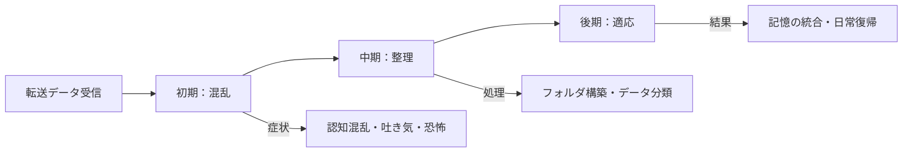
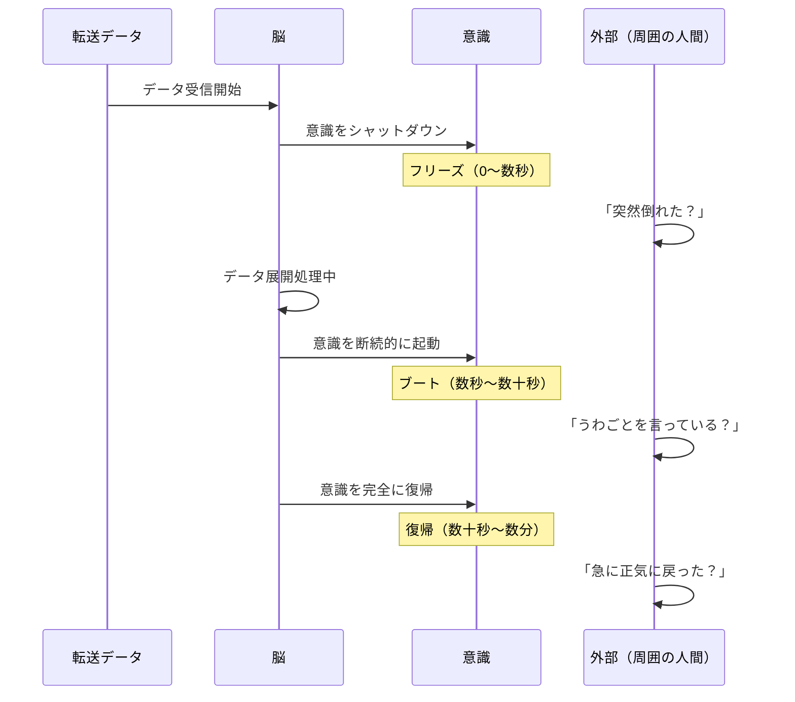
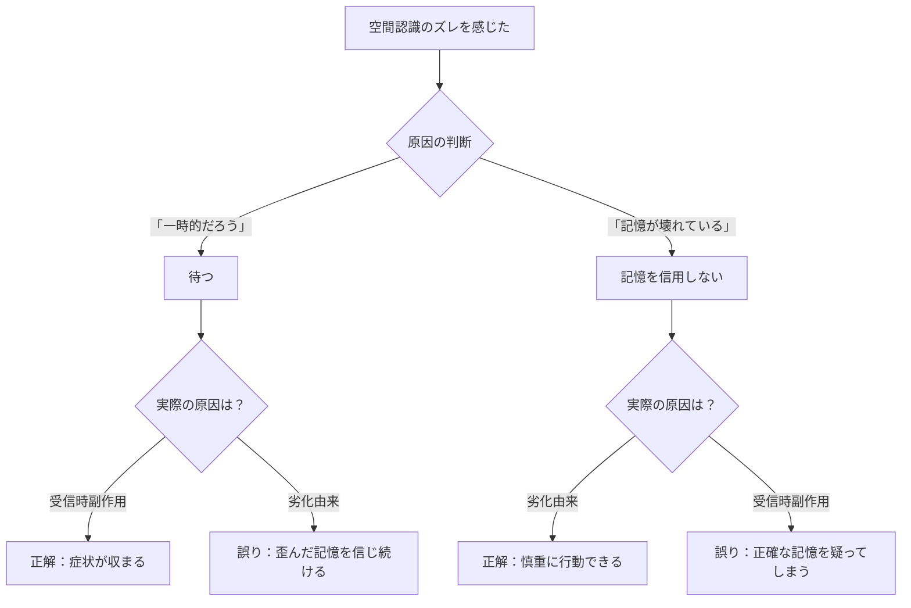

## 第5章：受信と副作用

過去の自分が転送データを受信した際、脳は段階的な処理を行う。この章では、受信時に何が起こるか、受信中の無防備な状態、そして受信に伴う身体的副作用について解説する。

---

### 5.1 受信時の反応

転送データを受信した過去の自分は、即座に情報を処理できるわけではない。脳が未知のデータを展開し、自分のものとして統合するまでには段階的な適応プロセスが必要になる。

---

#### 適応の三段階

|段階|時期|状態|内容|
|---|---|---|---|
|初期|受信直後|混乱|未知の情報が一気にダウンロードされ、認識が混乱する|
|中期|数分〜数時間後|整理|脳が専用の記憶フォルダを構築し、データを整理する|
|後期|数時間〜数日後|適応|徐々に慣れ、転送記憶を自分のものとして扱える|

---

#### 初期段階の症状

受信直後は最も混乱が激しい。能力者には以下の症状が現れる。

|症状|内容|
|---|---|
|認知的混乱|「今」がいつか分からなくなる|
|記憶の重複感|同じ出来事を二度体験したような感覚|
|感覚の再現|コンプレッションセンスによる痛みや恐怖の体感|
|生理反応|吐き気、めまい、冷や汗|
|時間の二重認識|「死んだ後の自分」と「今の自分」の認識が重なる|

特に初回のループ受信は衝撃が大きい。能力者は「自分が死んだ」という記憶を突然受け取ることになるが、現在の自分は生きている。この矛盾した認識が脳に強い負荷をかける。

---

#### 中期段階の処理

初期の混乱を脱すると、脳はデータの整理に入る。

|処理内容|詳細|
|---|---|
|フォルダ構築|転送データを専用の領域に隔離して格納する|
|時系列の整理|「これは未来の記憶だ」というラベル付けが行われる|
|現在との区分|転送記憶と現在の記憶を別のものとして分類する|

この段階では能力者はまだ転送記憶に翻弄されるが、「これは今ではなく、別の時間の出来事だ」という認識が徐々に形成されていく。

---

#### 後期段階の適応

|状態|内容|
|---|---|
|記憶の統合|転送記憶を「自分の過去の経験」として自然に参照できるようになる|
|感覚の沈静|コンプレッションセンスによる痛みや恐怖が薄れていく|
|日常復帰|通常の生活に戻れる状態になる|

後期段階に到達すれば、能力者は転送記憶を「情報源」として活用できるようになる。ただし、転送回数が増えるほど中期・後期への移行に時間がかかるようになり、脳の負荷累積（第8章で解説）が進んだ状態では適応そのものが困難になる。

---

### 5.2 脆弱性ウィンドウ

転送データを受信した過去の自分は、データの展開処理中に一時的な機能停止を起こす。この無防備な時間帯を「脆弱性ウィンドウ（Vulnerability Window）」と呼ぶ。

---

#### 基本定義

| 項目      | 内容                             |
| ------- | ------------------------------ |
| 正式名称    | 脆弱性ウィンドウ（Vulnerability Window） |
| 発生タイミング | 転送データの受信時                      |
| 原因      | 脳がデータ展開処理に全リソースを割り当てるため        |
| 制御      | 不可能（いつ受信するか能力者には選べない）          |
| 外部からの認識 | 「突然おかしくなった」ように見える              |

---

#### 三段階の処理フェーズ

|段階|名称|時間|脳の状態|外から見た様子|
|---|---|---|---|---|
|第1段階|フリーズ|0〜数秒|データ展開開始。意識が完全にオフラインになる|目が虚ろになる。呼びかけに無反応。その場に崩れ落ちる|
|第2段階|ブート|数秒〜数十秒|データ展開中。意識が断続的に明滅する|うわごと、痙攣、焦点の合わない目で周囲を見回す|
|第3段階|復帰|数十秒〜数分|展開完了。意識が完全にオンラインに戻る|急に正気に戻ったように振る舞う|

---

#### 脆弱性ウィンドウ中の危険

|段階|攻撃された場合|
|---|---|
|フリーズ中|完全に無防備。回避・防御は不可能|
|ブート中|意識が断続的なため、反応できるかは不確定|
|復帰後|通常通り対応可能だが、混乱が残っている場合あり|

フリーズ段階が最も危険である。この数秒間、能力者は立っていることすらできず、外界の刺激に対して一切反応できない。戦闘中や逃走中に脆弱性ウィンドウが発生した場合、それは即座に死を意味しうる。

---

#### 戦略的リスク

|リスク|内容|
|---|---|
|タイミングの非制御|受信がいつ起きるか能力者にも分からない|
|戦闘中の発生|フリーズ中に攻撃されれば無抵抗で死亡する|
|目撃リスク|他者に見られると「異常者」として認識される|
|秘密の露見|フリーズ中のうわごとで能力に関する情報が漏れる可能性|
|社会生活への支障|会話中、運転中、仕事中に突然発生する|

---

#### ウィンドウの長さに影響する要因

|要因|ウィンドウへの影響|
|---|---|
|転送データ量|多いほどウィンドウが長くなる|
|脳の負荷累積|累積が多いほど展開処理が遅くなり、ウィンドウが長くなる|
|受信回数|初回は長く、慣れるほどやや短くなる傾向がある|
|情報欠落の有無|欠落がある場合、展開すべきデータが減るためウィンドウはやや短くなる|

脳の負荷が累積した状態での受信は、ウィンドウが顕著に長くなる。疲弊した脳は展開処理に時間がかかるため、フリーズとブートの段階が引き延ばされる。これは第8章で解説する「悪循環」の一要因となる。

---

### 5.3 空間認識のズレ

リヴァイブの転送に伴い、能力者は空間認識の異常を経験することがある。この現象には二つの発生源があり、それぞれ原因・タイミング・持続時間が異なる。

---

#### 二重発生構造

|発生源|原因|タイミング|持続|
|---|---|---|---|
|劣化由来|転送中のノイズで空間記憶が歪んだ|転送記憶を参照した時|記憶を参照するたびに発生（恒久的）|
|受信時副作用|死亡時の身体感覚と現在の身体状態の不一致|受信直後〜適応期間|時間経過で収まる（一時的）|

---

#### 劣化由来の空間認識ズレ

転送中のノイズによって空間情報が歪んだ状態で記憶に定着したもの。能力者が転送記憶の中の「場所」を思い出そうとするたびに症状が発生する。記憶そのものが壊れているため、時間が経っても治らない。

---

#### 受信時副作用の空間認識ズレ

死亡した瞬間の身体状態（姿勢、向き、重力方向）が感覚データとして転送され、受信した過去の自分の身体状態と衝突することで発生する。

たとえば、倒れた状態で死亡した記憶を、立った状態で受信すると、脳が「上下」の情報を二重に処理してしまう。これは一時的なもので、脳が現在の身体情報を優先し始めれば収まる。

---

#### 症状

|症状|内容|メカニズム|
|---|---|---|
|上下左右の錯覚|平衡感覚の混乱。傾いている感覚、天地逆転の感覚|死亡時の姿勢と現在の姿勢の不一致、または空間記憶の歪み|
|距離感の狂い|近いものが遠く、遠いものが近く感じる|空間スケール情報の劣化|
|吐き気・めまい|自律神経の反応。VR酔いに類似|視覚情報と平衡感覚の矛盾|

三つの症状は独立して発生する。どの組み合わせになるかは予測できない。

|パターン|発生する症状|能力者への影響|
|---|---|---|
|単一症状|いずれか1つ|対処可能だが不快|
|二重症状|いずれか2つ|行動に支障が出る|
|三重症状|3つ全て|事実上の行動不能|

---

#### 能力者の判断課題

空間認識のズレが発生した場合、能力者は「これは今だけの症状か（受信時副作用）」それとも「記憶そのものが壊れているのか（劣化由来）」を判断しなければならない。

|判断|正しかった場合|間違っていた場合|
|---|---|---|
|「一時的だ、待てば治る」|症状が収まり正常に行動できる|劣化由来だった場合、歪んだ記憶を信じ続ける|
|「記憶が壊れている」|記憶に頼らず慎重に行動できる|受信時副作用だった場合、正確な記憶を無駄に疑ってしまう|

この判断を誤ると、歪んだ空間記憶に基づいて行動し致命的なミスを犯すか、正確な記憶を無駄に疑って行動が遅れるか、いずれにしても不利な状況に陥る。しかも、判断材料は自分の主観的な感覚しかなく、客観的に確認する手段がない。

---
