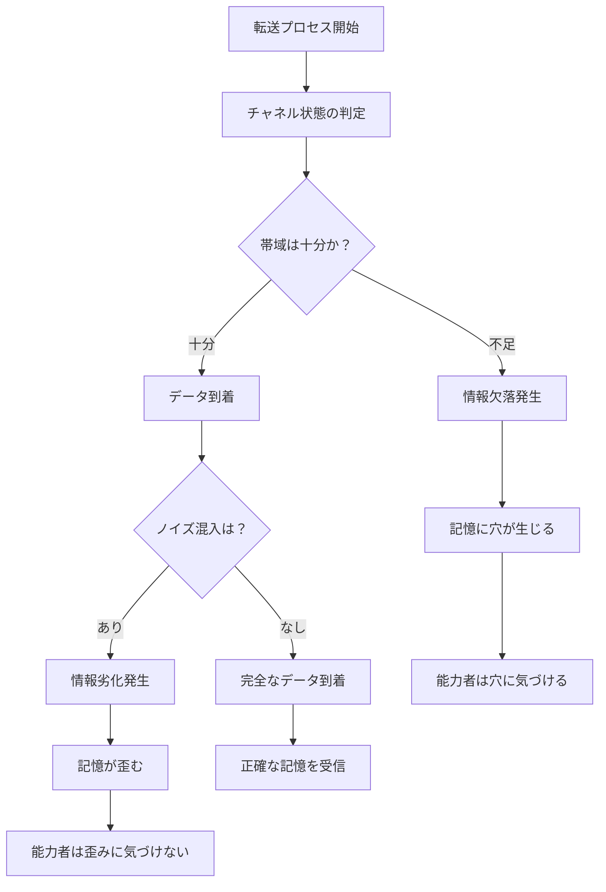
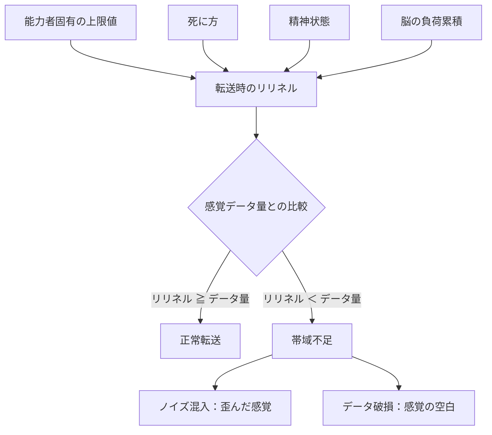
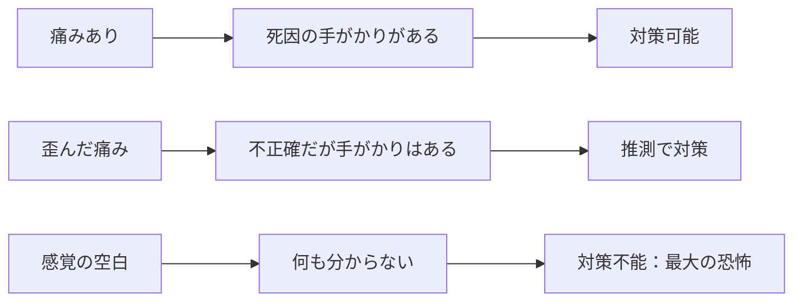

## 第6章：情報の損傷

転送プロセスは完璧ではない。チャネルの帯域制限やノイズの混入により、転送データには「欠落」と「劣化」という二種類の損傷が発生しうる。これらは独立した現象であり、同時に発生することも、片方だけが発生することもある。この章では、二種類の損傷と、感覚転送における帯域制限の概念「リリネル」について解説する。

---

### 6.1 情報欠落（データロス）

情報欠落は、転送チャネルの帯域が不足した場合に、データの一部がそもそも届かない現象である。

|項目|内容|
|---|---|
|正式名称|データロス（情報欠落）|
|原因|転送チャネルの帯域不足・混雑|
|結果|データの一部が完全に消失|
|自覚|可能（記憶に「穴」があることに気づける）|
|回復|不可能（失われたデータは復元できない）|

---

#### 欠落の具体例

|欠落対象|能力者の体験|
|---|---|
|人物の顔|誰かと話していた記憶はあるが、相手の顔が完全に空白|
|会話の一部|話の前後は覚えているのに、核心部分だけが丸ごと抜けている|
|時間の断片|5分間の記憶のうち、数十秒が完全に存在しない|
|空間情報|部屋にいた記憶はあるが、部屋の形や出入口の位置が分からない|

欠落した部分は「ぼやけている」のではなく、完全に存在しない。本のページが破り取られたように、そこには何もない。能力者はこの「何もなさ」を認識できるため、欠落が発生したこと自体には気づくことができる。

---

#### 情報欠落の特性

|特性|内容|
|---|---|
|自覚可能|欠落した部分は「何もない」と認識できる|
|予測不能|どの部分が欠落するかは制御できない|
|非復元|一度失われたデータは二度と取り戻せない|
|累積影響|脳の負荷が高いほど欠落が発生しやすくなる|

---

### 6.2 情報劣化（データデグラデーション）

情報劣化は、データは届いたものの、転送中にノイズが混入し精度が低下する現象である。欠落とは異なり、データは存在する。しかしその内容が正確ではない。

|項目|内容|
|---|---|
|正式名称|データデグラデーション（情報劣化）|
|原因|転送中のノイズ混入・再構成時の誤差|
|結果|データは存在するが正確でない|
|自覚|困難（劣化した記憶を「正しい」と思い込む）|
|回復|不可能（元の正確なデータは失われている）|

---

#### 劣化の具体例

|劣化対象|能力者の体験|
|---|---|
|人物の顔|覚えているが、ぼやけている。別人の特徴が混入していることもある|
|会話の内容|覚えているが、実際とは微妙に違う内容になっている|
|場所の位置関係|覚えているが、左右が反転している。距離感が歪んでいる|
|時間の順序|出来事の前後関係が入れ替わっている|

---

#### 情報劣化の特性

|特性|内容|
|---|---|
|自覚困難|劣化した記憶は「正しい記憶」として認識される|
|欠落より危険|間違った情報を信じて行動するリスクがある|
|検証不能|記憶の正確性を確認する手段がない|
|累積悪化|ループを重ねるほど劣化の頻度と程度が増す|

---

### 欠落と劣化の比較

|項目|情報欠落|情報劣化|
|---|---|---|
|状態|データが存在しない|データが不正確|
|自覚|できる（穴に気づく）|できない（正しいと思い込む）|
|危険性|「分からない」と自覚できる分、慎重になれる|「知っている」と思い込む分、誤った行動を取る|
|対策|欠落の存在を前提に行動する|対策が取りにくい（そもそも気づけない）|

能力者にとって真に危険なのは劣化の方である。欠落は「分からない」という不安を与えるが、不安は慎重さを生む。劣化は「分かったつもり」という誤信を与え、誤信は誤った確信を生む。確信に基づいた誤った行動は、取り返しのつかない結果を招きうる。

---

### 6.3 リリネル

リリネル（Relinnel）は、感覚データ転送時のチャネル帯域を規定する概念である。コンプレッションセンス（第4章）が感覚を転送する際、その帯域の上限を定める。

---

#### リリネルの定義

|項目|内容|
|---|---|
|正式名称|リリネル（Relinnel）|
|語源|Release（解放）+ Channel（チャネル）|
|定義|感覚データ転送時に確保されるチャネルの解放量|
|役割|転送可能な感覚データの帯域を決定する|

リリネルとは「感覚をどれだけ転送できるか」の上限を示す値である。痛みや恐怖などの感覚データ量がリリネルの範囲内であれば正常に転送されるが、リリネルを超えた場合、感覚データに歪みや空白が発生する。

---

#### リリネルのモデル

リリネルの挙動は作品の設計思想に応じて三つのモデルから選択できる。

|モデル|内容|物語的効果|
|---|---|---|
|動的変動型|転送時の状況（死に方、精神状態、負荷の蓄積度）で変動する|「今回はちゃんと届くか分からない」という不確定の緊張感|
|固定上限型|能力者ごとにリリネルの上限値が固定されている|能力者間の個体差。「自分は帯域が狭い」という制約|
|複合型|固定上限の中で状況に応じて変動する|上限に近い状況ほどリスクが高まる構造|

本資料では複合型を基本モデルとして記述する。

---

#### 複合型リリネルの構造

---

#### 痛みの強度とリリネルの関係

|痛みの強度|リリネル（チャネル解放量）|転送結果|受信側の体験|
|---|---|---|---|
|低〜中|十分（必要帯域を確保）|正常に圧縮・転送|痛みをそのまま体感する|
|高|不足気味（帯域が逼迫）|圧縮にノイズが入る|歪んだ痛み（実際と異なる部位が痛む、強度がずれる）|
|極限（閾値超過）|枯渇（帯域が完全に不足）|データ破損・欠落|何も感じない（感覚の空白）|

---

#### リリネルに影響する要因（複合型）

|要因|リリネルへの影響|例|
|---|---|---|
|脳の負荷累積|累積が多いほどリリネルが低下する|疲弊した能力者は軽い痛みでも転送が不安定になる|
|死に方|瞬間的な死ほどリリネルが確保されにくい|爆死や即死に近い死に方ではチャネル確保の時間がない|
|精神状態|パニック時はリリネルが低下する|極度の恐怖状態ではチャネル制御が乱れる|
|能力者固有の上限|個体差として上限が異なる|同じ痛みでも、能力者Aは正常転送、能力者Bは閾値超過となりうる|

---

#### 感覚の空白が意味するもの

|受信した感覚|解釈|
|---|---|
|明確な痛み|前回の死に方が分かる。対策が立てられる|
|歪んだ痛み|前回の死に方の手がかりはあるが、不正確|
|何も感じない（空白）|前回は閾値を超える壮絶な死に方をした。具体的な死因は不明|

---

#### 逆転の恐怖構造

通常、痛みは恐怖の対象である。しかしリヴァイブにおいては、「痛みがない」ことの方が恐ろしい。

痛みが転送されたということは、少なくとも死に方の情報が手に入ったということだ。感覚の空白は、前回の死が想像の及ばないものだったことを示す唯一の証拠であり、そこから先は何も分からない。

---

#### リリネルと情報欠落・劣化の構造的共通性

リリネルは感覚データ（コンプレッションセンス）に対する帯域制限を定義する概念だが、同じ原理は記憶データの転送にも適用される。本章6.1・6.2で解説した情報欠落・情報劣化は、記憶転送チャネルにおける帯域不足とノイズ混入の結果であり、リリネルと同じ構造的原因を共有している。

|チャネル種別|帯域制限の概念|帯域不足時の結果|
|---|---|---|
|感覚チャネル|リリネル|感覚の歪みまたは空白|
|記憶チャネル|（同原理）|情報欠落または情報劣化|

感覚チャネルと記憶チャネルは独立して動作するが、帯域不足が発生する構造は同一である。一方が正常でも他方で損傷が起こることがあり、また両方同時に帯域不足に陥ることもある。

---
