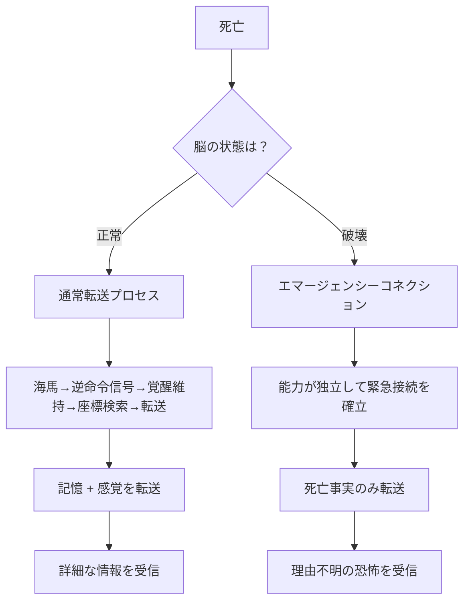
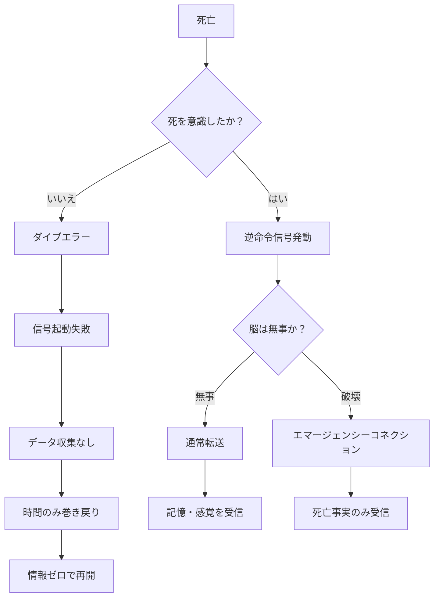
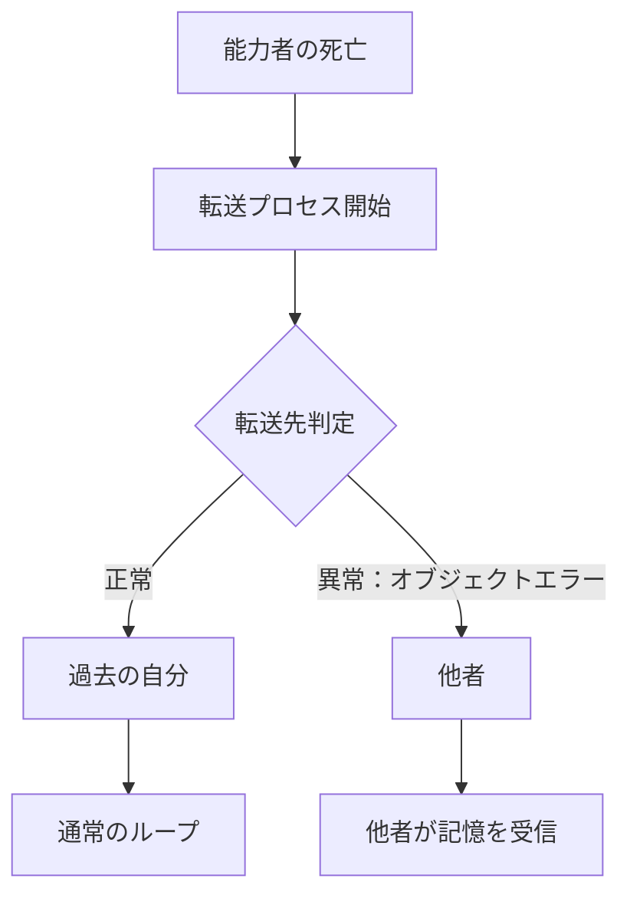
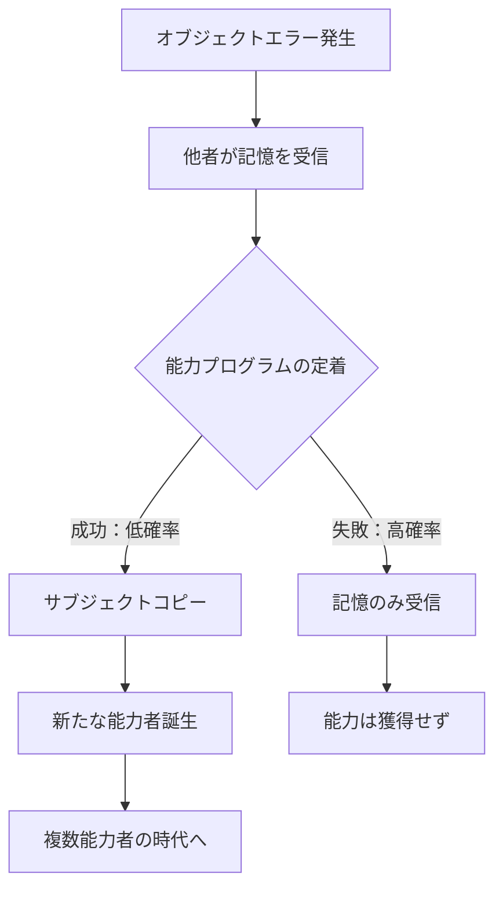
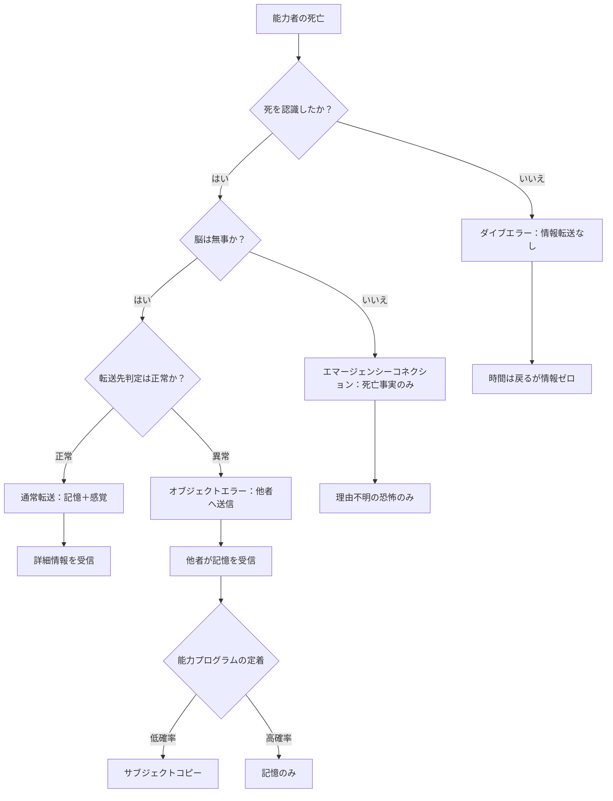

## 第7章：エラーと緊急機能

リヴァイブは完璧なシステムではない。特定の条件下では転送が正常に行われず、予期せぬ挙動を示すことがある。この章では、緊急時の代替機能と各種エラー、そしてエラーから派生する能力伝播現象について解説する。

---

### 7.1 エマージェンシーコネクション

エマージェンシーコネクション（Emergency Connection）は、脳そのものが破壊された場合に自動起動する緊急転送機能である。

|項目|内容|
|---|---|
|正式名称|エマージェンシーコネクション（緊急接続）|
|発動条件|脳が物理的に破壊された場合|
|転送内容|死亡した事実のみ（緊急サマリー）|
|詳細記憶|転送不可能|

---

#### 通常転送との比較

|項目|通常転送|エマージェンシーコネクション|
|---|---|---|
|発動条件|死亡全般|脳破壊時のみ|
|記憶転送|約250MB（5分間相当）|不可能|
|感覚転送|可能|最小限（恐怖のみ）|
|転送情報|詳細な記憶と感覚|「前回死んだ」という事実のみ|
|時間座標選定|通常ロジック（感情的刻印→安全性）|不明（能力が自動決定）|

エマージェンシーコネクションは通常転送の「劣化版」ではなく、まったく別の緊急系統である。脳が破壊された状態で通常の転送プロセスは実行できないため、能力が独自のバックアップ機構として最小限の情報だけを送り出す。

---

#### 発動のメカニズム

通常転送は「海馬が逆命令信号を発する→脳が覚醒を維持→座標検索→転送」という手順を踏む。しかし脳が破壊されている場合、この手順の大部分が実行不可能になる。エマージェンシーコネクションは、この手順を全て省略し、能力そのものが独立して最低限の接続を確立する。

---

#### 受信時の症状

エマージェンシーコネクションで転送されるのは「死んだ」という事実だけであり、死因や状況の記憶は含まれない。受信者には以下の症状が現れる。

|症状|内容|
|---|---|
|理由不明の恐怖|突然、強烈な恐怖に襲われる|
|記憶の欠如|何が起きたか分からない|
|生理反応|激しい吐き気、嘔吐|
|心理状態|トラウマのフラッシュバックに似た状態|

通常転送であれば「何で死んだか」が分かるため対策を講じられる。しかしエマージェンシーコネクションでは「死んだ」という事実しか分からない。能力者は「自分は前回死んだ。だが何に殺されたか分からない」という状態に置かれる。

---

#### 戦略的意味

|リスク|内容|
|---|---|
|頭部防御の最優先|脳を守ることが生存戦略の基本となる|
|弱点の露見|敵に「脳を狙えば記憶が残らない」と気づかれると致命的|
|無限ループの恐怖|何が原因で死んだか分からないまま、同じ死を繰り返す可能性|

三番目のリスクが最も深刻である。脳を破壊されて死亡し、エマージェンシーコネクションで戻り、しかし死因が分からないため同じ状況に身を置き、再び脳を破壊されて死亡する。この無限ループに陥った能力者は、毎回「理由不明の恐怖」だけを受け取りながら、同じ死を繰り返す。

---

### 7.2 ダイブエラー

ダイブエラー（Dive Error）は、意識外からの死によって転送プロセスが完全に失敗する現象である。エマージェンシーコネクションが「劣化した転送」であるのに対し、ダイブエラーは「転送の完全な失敗」である。

|項目|内容|
|---|---|
|正式名称|ダイブエラー（転送失敗）|
|発動条件|意識外からの死（不意打ち、睡眠中、気づかない毒殺など）|
|転送内容|なし（完全な断絶）|
|結果|時間だけが巻き戻り、情報は一切得られない|

---

#### 発生メカニズム

ダイブエラーの核心は「死を認識できなかった」ことにある。リヴァイブの転送プロセスは、能力者が「自分は死ぬ」と認識することで海馬が逆命令信号を発するところから始まる。死を認識できなければ、逆命令信号は正常に起動せず、後続の全プロセスが実行されない。

|ステップ|通常時|ダイブエラー時|
|---|---|---|
|1|死を感知する|死を感知できない|
|2|海馬が逆命令信号を発動|逆命令信号が正常起動しない|
|3|データ収集プロセス開始|プロセスが走らない|
|4|転送実行|断絶が発生|

---

#### エマージェンシーコネクションとの違い

|項目|エマージェンシーコネクション|ダイブエラー|
|---|---|---|
|原因|脳が物理的に破壊された|死を意識できなかった|
|死の認識|あり（認識はしたが処理できない）|なし（認識そのものが不在）|
|転送|最小限（死亡事実のみ）|一切なし|
|受信側の体験|理由不明の恐怖|何も起こらない|
|時間の巻き戻り|発生する|発生する|

重要な点は、ダイブエラー時でも時間の巻き戻りは発生するということである。時間の巻き戻り（テンポラレル側の機能：第9章で解説）とリヴァイブの情報転送は独立したシステムであるため、転送が失敗しても時間は戻る。結果として、能力者は過去に戻っているのに何も情報を持っていないという状態になる。

---

#### ダイブエラーを引き起こす死因の例

|死因カテゴリ|具体例|
|---|---|
|不意打ち|背後からの襲撃、狙撃|
|睡眠中|睡眠中の暗殺、就寝中の火災|
|無自覚|気づかない毒殺、無臭ガス|
|瞬間的|認識する間もない爆発|

共通するのは「死が訪れることを能力者が認知できない」という点である。痛みを感じる暇もなく、恐怖を覚える間もなく、意識が途絶える。

---

#### 戦略的リスク

|リスク|内容|
|---|---|
|最も危険な死に方|不意打ちはリヴァイブの最大の弱点|
|原因特定不能|何度ループしても死因が分からない|
|常時警戒|能力者は常に周囲を警戒し続けなければならない|
|精神的消耗|「いつ殺されるか分からない」という恐怖|

ダイブエラーが最も恐ろしいのは、対策の取りようがないことである。通常転送なら死因が分かる。エマージェンシーコネクションなら「死んだ」という事実だけでも分かる。ダイブエラーでは何も分からない。能力者は過去に戻されたことにすら気づかない可能性がある。

---

### 7.3 オブジェクトエラー

オブジェクトエラー（Object Error）は、記憶が本来の転送先（過去の自分）ではなく、他者に送信されてしまう誤作動である。

|項目|内容|
|---|---|
|正式名称|オブジェクトエラー（誤送信）|
|発生頻度|ごく稀|
|転送先|他者（能力の有無を問わない）|
|制御|不可能（意図的に起こせない）|

---

#### 発生条件

オブジェクトエラーの発生条件は明確に特定されていない。転送プロセスの途中で「宛先」が何らかの理由で書き換わり、過去の自分ではなく他者に記憶が送信される。能力者がこれを意図的に起こすことはできず、発生を予測することもできない。

---

#### 受信者への影響

オブジェクトエラーで記憶を受け取った他者は、以下の影響を被る。

|影響|内容|
|---|---|
|未知の記憶|突然、自分のものではない記憶が流れ込む|
|混乱|自己と他者の記憶の区別がつかなくなる|
|情報漏洩|能力者のループの秘密が露見する|
|関係性変化|信頼関係の構築または崩壊|

受信者はリヴァイブ能力を持たない一般人であることが多い。何の前触れもなく他人の記憶が流れ込む体験は、受信者にとって極めて衝撃的であり、精神的な動揺を引き起こす。

---

#### 受信者が体験するもの

受信者は脆弱性ウィンドウ（第5章）と類似した症状を経験する。ただし、能力を持たないため脳の受信体制が整っておらず、通常の能力者よりも混乱が深刻になる傾向がある。

|段階|内容|
|---|---|
|受信直後|突然の意識混濁。原因不明の混乱状態に陥る|
|短期|「自分のものではない記憶」の存在に気づく|
|中期|記憶の内容を理解し始める。能力者の体験を追体験する|
|長期|受け入れるか、拒絶するか。精神的な対処を迫られる|

---

#### 哲学的問題

オブジェクトエラーは、記憶とアイデンティティに関する根本的な問いを提起する。

|問い|内容|
|---|---|
|アイデンティティ|他人の記憶を受け取った人は、まだ「自分」か？|
|記憶の真偽|受け取った記憶が本物かどうか、どう判断するか？|
|未来の記憶|まだ起きていない出来事の記憶をどう処理するか？|

---

### 7.4 サブジェクトコピー

サブジェクトコピー（Subject Copy）は、オブジェクトエラーで記憶を受け取った者が、低確率でリヴァイブ能力を獲得する現象である。オブジェクトエラーの「結果」として発生しうる二次的現象であり、独立した事象ではない。

|項目|内容|
|---|---|
|正式名称|サブジェクトコピー（能力伝播）|
|発動条件|オブジェクトエラーで記憶を受信|
|発生確率|低確率|
|結果|受信者がリヴァイブ能力を獲得|

---

#### 推測されるメカニズム

|ステップ|内容|
|---|---|
|1|転送される記憶データに能力のプログラムが含まれている|
|2|受信者の脳が能力を逆コンパイル|
|3|能力が受信者の脳に定着|
|4|新たな能力者が誕生|

通常転送において、記憶データには能力の動作プログラムの一部が付随している可能性がある。通常はこのプログラムが過去の自分（既に能力を保有している）に送られるため問題にならない。しかしオブジェクトエラーで能力を持たない他者に送られた場合、受信者の脳がこのプログラムを「新規インストール」として処理し、能力が定着することがある。

---

#### 能力の自己増殖性

サブジェクトコピーの存在は、リヴァイブが単なる「道具」ではなく、自己増殖する性質を持つ可能性を示唆している。転送データに能力のプログラムが含まれることは、情報転送にとって必要ない。にもかかわらず含まれているということは、能力自体が「広がろうとする意志」を持っているのか、あるいは単にシステム上の副作用なのか。この問いは第13章の考察で改めて扱う。

---

#### 戦略的意味

|状況|意味|
|---|---|
|敵が能力を獲得|タイムループバトルの発生。互いにループし合う消耗戦|
|味方が能力を獲得|協力関係の可能性。ただし意図的な情報共有は不可能|
|複数能力者の交錯|時系列が複雑化し、正史の概念が揺らぐ|
|起源の謎|「最初のループ者」は誰か？という問いが生まれる|

---

#### 倫理的ジレンマ

|ジレンマ|内容|
|---|---|
|拡散の是非|能力を広めるべきか、封じるべきか？|
|記憶の衝突|複数の能力者の記憶が衝突したら現実はどうなる？|
|正史の決定権|タイムラインの「正史」は誰が決めるのか？|

---

### エラー・緊急機能の全体像

本章で解説した四つの事象を、死亡状況との関係で整理する。

|事象|トリガー|情報転送|受信側の体験|危険度|
|---|---|---|---|---|
|通常転送|死を認識＋脳が無事|記憶＋感覚|詳細な情報を受信|低|
|エマージェンシーコネクション|死を認識＋脳が破壊|死亡事実のみ|理由不明の恐怖|高|
|ダイブエラー|死を認識できず|なし|何も起こらない|最高|
|オブジェクトエラー|転送先の誤判定|記憶＋感覚（他者へ）|他者が能力者の記憶を受信|状況依存|

---
