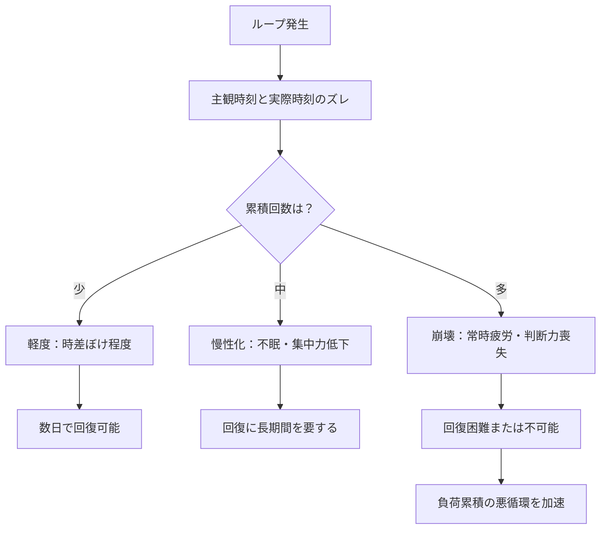
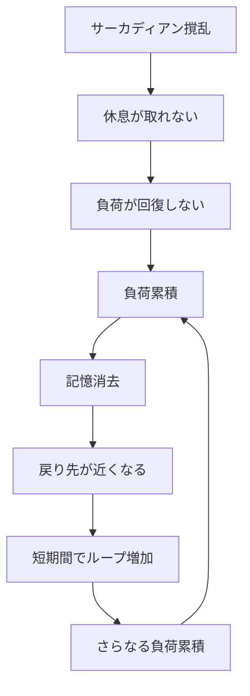
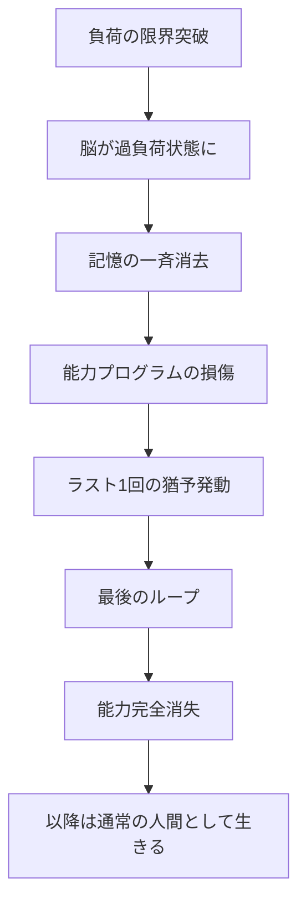

## 第8章：累積効果

リヴァイブは回数制限のない能力だが、無限に使えるわけではない。使用するたびに能力者の心身に負荷が蓄積し、やがて取り返しのつかない結果を招く。この章では、ループの累積による副作用、身体への影響、脳の負荷システム、そして能力の終焉について解説する。

---

### 8.1 ループの副作用

リヴァイブを繰り返すことで、能力者には様々な副作用が現れる。これらは一度のループでは軽微だが、回数を重ねるごとに深刻化し、やがて不可逆になる。

|副作用|内容|
|---|---|
|記憶の混濁|どのループの記憶か分からなくなる|
|感覚の鈍化|死の痛みに慣れてしまう|
|時間感覚の喪失|主観時間と客観時間がズレる|
|人格の変質|繰り返しによる精神の摩耗|

---

#### 記憶の混濁

ループを重ねると、能力者は「どの記憶がどのループのものか」を区別できなくなっていく。特に類似した状況を何度も経験した場合、記憶が混ざり合い、正確な判断が困難になる。

|ループ回数|記憶の状態|
|---|---|
|1〜5回|明確に区別可能|
|6〜15回|類似した記憶が混同し始める|
|16〜30回|区別が困難になる|
|31回以上|深刻な混濁。自分の経験が信用できなくなる|

フォルダシステム（第4章）は直近3回分の転送記憶しか保持しないが、能力者の「通常の記憶」としてループ中に体験した出来事は脳に残り続ける。この通常記憶が複数のループにわたって蓄積されることで混濁が発生する。

---

#### 感覚の鈍化

コンプレッションセンスによって死の痛みを何度も体験すると、脳は防衛機制として感覚を鈍化させる。一見すると楽になるように思えるが、これは危険を察知する能力の低下を意味する。

|段階|内容|
|---|---|
|初期|死の痛みに強い恐怖と苦痛を感じる|
|中期|痛みへの反応が鈍くなる|
|後期|死を「慣れた体験」として認識してしまう|

感覚の鈍化は一見すると能力者にとって楽になる変化に思えるが、実際には致命的なリスクを孕んでいる。痛みや恐怖は「これ以上進むと死ぬ」という警告信号である。この信号が鈍化するということは、能力者が危機的状況において適切な回避行動を取れなくなることを意味する。

---

#### 時間感覚の喪失

ループを繰り返すたび、能力者の主観的な経験時間は実際の時間よりも長くなっていく。10回ループした能力者は、周囲の人間の10倍の時間を体験している。

|項目|能力者|非能力者|
|---|---|---|
|経過した客観時間|3日|3日|
|主観的な体験時間（10回ループ）|約30日|3日|
|結果|周囲との時間感覚にズレが生じる|変化なし|

この「主観時間のズレ」は人間関係に深刻な影響を与える。能力者にとっては1ヶ月分の体験があるのに、相手にとっては3日しか経っていない。会話のテンポ、感情の深度、関係性の成熟度が完全にずれてしまう。

---

#### 人格の変質

繰り返される死と再生は、能力者の価値観、感情、人格そのものを変容させていく。

|段階|特徴|
|---|---|
|第1段階|命の重さを強く感じる|
|第2段階|死を恐れなくなる|
|第3段階|他者の死にも鈍感になる|
|第4段階|人間的な感情が摩耗する|
|第5段階|自分が「人間」かどうか分からなくなる|

100回死んだ人間は、まだ「同じ人間」と言えるだろうか。この問いに明確な答えはない。しかし確実に言えるのは、ループを繰り返すほど能力者は「死を特別なものと感じなくなる」ということであり、それは人間としての基本的な感覚からの逸脱を意味する。

---

### 8.2 体内時計のズレ（サーカディアン撹乱）

ループによって能力者が過去の時点に戻された際、主観的な体内時計と実際の時刻の間にズレが発生する。これは累積効果の一種であり、ループを重ねるほど深刻化する。

---

#### 基本メカニズム

|項目|内容|
|---|---|
|原因|主観的な体内リズムと、戻り先の実際の時刻の不一致|
|比喩|極度の時差ぼけに類似|
|単発の影響|軽度（1〜2回のループなら回復可能）|
|累積の影響|深刻（繰り返すほど体内時計が修復不能になる）|

たとえば深夜3時の感覚のまま昼12時に戻された場合、能力者の身体は「今は真夜中だ」と認識している。強烈な眠気に襲われ、身体が覚醒を拒否する。逆に、朝の感覚で深夜に戻された場合は、眠れない過覚醒状態に陥る。

---

#### 累積段階

|ループ回数|体内時計の状態|症状|
|---|---|---|
|1〜3回|軽度のズレ|時差ぼけ程度。眠気、倦怠感。数日で回復|
|4〜10回|慢性的な撹乱|不眠、食欲異常、集中力低下。回復に時間がかかる|
|11〜20回|重度の撹乱|昼夜逆転が常態化。睡眠障害。判断力の著しい低下|
|21回以上|体内時計の崩壊|昼夜の区別がつかない。常時の疲労感。身体機能の全般的低下|

---

#### 他の副作用との相互作用

体内時計のズレは単独でも深刻だが、他の累積効果と相互に悪化させ合う。

|相互作用|内容|
|---|---|
|記憶の混濁 × サーカディアン撹乱|睡眠不足で記憶の整理ができず、混濁が加速する|
|脳の負荷累積 × サーカディアン撹乱|適切な休息が取れないため、負荷の回復ができない|
|脆弱性ウィンドウ × サーカディアン撹乱|睡眠時にウィンドウが発生すると、覚醒と睡眠のリズムがさらに狂う|

---

### 8.3 脳の負荷システム

リヴァイブの使用は脳に物理的な負荷を与える。この負荷は累積し、休息を取らなければ深刻な結果を招く。

|項目|内容|
|---|---|
|負荷の原因|記憶・感覚データの受信と展開処理|
|累積性|使用するたびに蓄積される|
|回復方法|休息を取ること|
|放置した場合|記憶が消去されていく|

---

#### 耐久時間と負荷の関係

第3章で解説した通り、長く意識を保つほど転送データ量が増大し、受信時の展開負荷も増加する。

|耐久時間|転送データ量|受信時の負荷|
|---|---|---|
|10秒（1日分）|小|低|
|60秒（6日分）|中|中|
|120秒（12日分）|大|高|

---

#### 負荷累積時の記憶消去メカニズム

脳の負荷が限界に達すると、脳は自動的に負荷軽減を開始する。このとき、能力者の通常記憶（人生の記憶）が古い順に消去される。これはフォルダシステム（第4章）による転送記憶の上書き削除とは別のメカニズムであり、能力者が生きてきた中で蓄積した一般的な記憶が対象となる。

| 段階  | 状況                     |
| --- | ---------------------- |
| 1   | ループの繰り返しで負荷が蓄積         |
| 2   | 休息を取らない（または取れない）       |
| 3   | 脳の負荷が限界に到達             |
| 4   | 脳が負荷軽減を自動実行            |
| 5   | 能力者の通常記憶（人生の記憶）が古い順に消去 |
| 6   | 結果として「戻れる過去」が近くなる      |

記憶が消去されるということは、時間座標検索（第3章）の選択肢が減るということである。選択肢が減れば、より近い過去にしか戻れなくなる。

---

#### 負荷と戻り先の悪循環

|ステップ|状態|
|---|---|
|1|負荷が累積する|
|2|古い記憶から消去される|
|3|戻れる時間座標の選択肢が減る|
|4|より近い過去にしか戻れなくなる|
|5|短期間で何度もループする羽目になる|
|6|さらに負荷が累積する|

これは自己強化型の悪循環である。一度このループに入ると、抜け出すことが極めて困難になる。さらにサーカディアン撹乱（8.2）によって適切な休息が取れない状態であれば、回復の機会すら失われる。

---

### 8.4 能力の終了条件

リヴァイブには明確な終わりがある。

|項目|内容|
|---|---|
|回数制限|なし|
|能力消失条件|脳が過負荷状態になり、記憶を一気に消去した時|
|最後の猶予|ラスト1回だけ戻れる|
|消失後|二度と発動しない|

---

#### 能力消失のプロセス

能力消失は段階的に進行する。まず脳が過負荷状態に陥り、自動的に記憶の一斉消去が実行される。この一斉消去の過程で能力のプログラム自体が損傷を受ける。損傷した能力は「ラスト1回」の転送を実行する余力だけを残し、それ以降は完全に機能を停止する。

---

#### ラスト1回の意味

能力消失の直前、リヴァイブは最後の1回だけ発動する。これは能力者にとって「最後のやり直し」であり、この1回を使い切った後は、二度とループすることはできない。

|状態|能力|
|---|---|
|通常|死亡時に発動（無制限）|
|過負荷後|ラスト1回のみ発動可能|
|最終使用後|完全消失（通常の人間に戻る）|

ラスト1回がいつ訪れるか、能力者に事前の通知はない。「次のループが最後かもしれない」という不確実性の中で、能力者は判断を迫られ続ける。

---

#### 「最後の死」の重み

能力を失った元能力者にとって、次の死は本当の死である。ループに依存してきた能力者ほど、この「本当の死」への恐怖は大きい。何十回、何百回と死んできた能力者が、初めて「取り返しのつかない死」に直面する。

---

### 8.5 その他の制約

リヴァイブには、負荷システム以外にも様々な制約がある。

---

#### 老衰死

|項目|内容|
|---|---|
|老衰時の発動|しない|
|理由|自然な死は逆命令信号のトリガーにならない|

老衰による死は、外傷や疾病による死とは本質的に異なる。脳が「生命の終わり」を自然なものとして受け入れるため、逆命令信号は発動しない。つまり、リヴァイブの能力者であっても、天寿を全うすれば普通に死ぬ。能力は「不老不死」を保証するものではない。

---

#### 容量制限

|項目|内容|
|---|---|
|記憶容量|約250MB（圧縮状態で約5分間相当）|
|フォルダ容量|記憶3回分、感覚3回分|
|上書き|古い順に自動上書き|

---

#### セーブポイントの非選択性

|項目|内容|
|---|---|
|任意設定|不可能|
|選定方法|記憶から自動検索|
|能力者の介入|できない|

能力者は「どこに戻るか」を自分で決めることができない。戻り先は能力が自動的に選定し、能力者はそれを受け入れるしかない。

---

#### 制約一覧表

|カテゴリ|制約|内容|
|---|---|---|
|物理的|脳破壊|詳細記憶の転送不可|
|物理的|意識外死|記憶・感覚の転送が失敗（時間の巻き戻りは発生）|
|物理的|容量制限|250MB（約5分間）のみ|
|システム的|死亡時限定|生存中は発動しない|
|システム的|自動検索|セーブポイントは選べない|
|システム的|誤作動|オブジェクトエラーのリスク|
|生理的|適応期間|転送直後は混乱する|
|生理的|感覚再現|痛みや恐怖が伝わる|
|生理的|精神負荷|ループによるトラウマ|
|生理的|老衰死|能力が発動しない|
|累積的|記憶混濁|ループ回数に応じて悪化|
|累積的|感覚鈍化|危機察知能力の低下|
|累積的|時間感覚喪失|主観時間と客観時間の乖離|
|累積的|サーカディアン撹乱|体内時計の崩壊|
|累積的|脳の負荷|休息なしでは記憶が消去される|
|終了的|能力消失|過負荷により永久に失われる|

---
