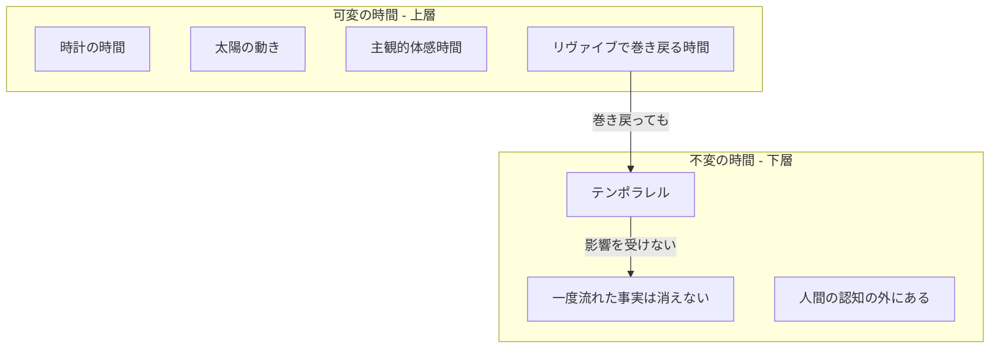
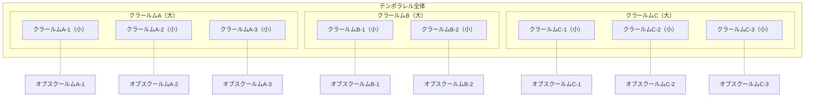
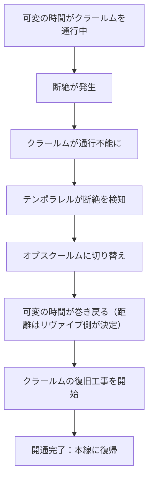
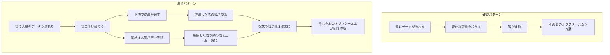
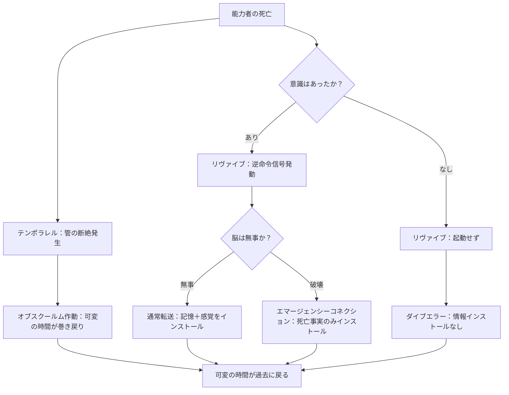

## 第9章：テンポラレル

リヴァイブにおいて「なぜ時間が巻き戻るのか」「なぜ非能力者にも累積記憶が残るのか」という二つの問いは、テンポラレルという物理法則の存在によって説明される。本章では、テンポラレルの定義、構造、挙動、およびリヴァイブとの関係について解説する。

---

### 9.1 可変の時間と不変の時間

本設定において「時間」は二つの層に分けられる。

|層|名称|性質|
|---|---|---|
|上層|可変の時間|伸び縮みする。人間が認知・体験・測定できる|
|下層|不変の時間|変化しない。人間が認知・観測できない|

---

#### 可変の時間

人間が「時間」と呼んでいるもの。時計で測れる時間、太陽が昇って沈む時間、「今日は長く感じた」という主観的な時間。人間が日常的にアクセスし、体験し、記録できる時間は全てこの層に属する。リヴァイブのループによって巻き戻るのも、この層の時間である。

---

#### 不変の時間

テンポラレルが存在する層。人間の認知とは無関係に存在するインフラである。可変の時間が巻き戻ろうが、伸びようが、縮もうが、不変の時間には影響しない。一度流れた事実は蓄積され、消えず、戻らない。人間がこの層に直接触れる手段は存在しない。

---

#### 二層構造が説明すること

|現象|説明|
|---|---|
|ループで時間が巻き戻る|可変の時間（上層）が巻き戻っている。人間の体験する時間は可変だから|
|非能力者に累積記憶が残る|不変の時間（下層）では「一度流れた事実」が消えない。可変の時間が戻っても、不変の時間に蓄積された痕跡は残り続ける|

---

### 9.2 テンポラレルの定義

|項目|内容|
|---|---|
|正式名称|テンポラレル（Temporallel）|
|語源|Temporal（時間的）+ Parallel（並行）の造語|
|意味|時の溜まり場|
|存在する層|不変の時間（下層）|
|分類|物理法則（リヴァイブとは独立して存在する）|
|リヴァイブとの関係|不明（関係しているとも言えるし、していないとも言える）|
|数|複数存在する|
|人間の認知|直接認知することはできない|

テンポラレルは、不変の時間の層において物理時間の流れを維持・管理するインフラである。人間が実際に生きている可変の時間とは異なるスピードで進んでおり、その動作原理は人間の認知の外にある。

リヴァイブが「能力」であるのに対し、テンポラレルは「法則」である。能力は個人に宿るが、法則は世界に存在する。テンポラレルはリヴァイブの能力者がいようといまいと、最初からそこにある。

---

### 9.3 パイプライン構造

テンポラレルは二種類のパイプラインから構成される。

|パイプライン|名称|語源|役割|比喩|
|---|---|---|---|---|
|メイン|クラールム（Clarum）|ラテン語で「明るい」|通常の時間の流れ。可変の時間がこのパイプを通って流れている|本線道路・水道本管|
|サブ|オブスクールム（Obscurum）|ラテン語で「暗い」|断絶時の迂回路。時間を巻き戻して再スタートさせる|迂回路・バイパス|

---

#### クラールムとオブスクールムの関係

全てのクラールムに対して、対応するオブスクールムが存在する。クラールムが正常に機能している限り、オブスクールムは使用されない。クラールムに問題が生じた時のみ、オブスクールムが作動する。

---

#### 可変の時間との関係

人間が体験する「可変の時間」は、クラールム（メインパイプライン）を通って流れている。人間はクラールムの中を生きているが、クラールムそのものを認知することはできない。水道管の中の水は蛇口から出てくることで認知できるが、水道管そのものは壁の中にあって見えないのと同じである。

|項目|内容|
|---|---|
|クラールムの中身|可変の時間（人間が体験する時間）|
|クラールム自体|不変の時間の層に属するインフラ|
|人間の認知|中身（時間）は体験できるが、管（テンポラレル）は認知できない|

---

### 9.4 ネットワーク構造

テンポラレルは単純な一本の管ではなく、入れ子構造と分散構造を持つ複雑なネットワークである。

---

#### 入れ子構造

クラールム（メインの管）の内部には、さらに小さなクラールムが密集して走っている。管の中に管がある構造である。

---

#### 分散構造

入れ子とは別に、独立したクラールムが複数存在する。それぞれが並行して機能している。

---

#### サブの対応

入れ子の小さな管にも、独立した大きな管にも、それぞれ対応するオブスクールムが存在する。どのレベルの管が損傷しても、対応するバイパスが用意されている。

---

### 9.5 断絶と巻き戻り

クラールムに断絶が発生すると、テンポラレルはオブスクールムに切り替えて時間を巻き戻し、その間にクラールムの復旧工事を行う。

---

#### 切り替えプロセス

|ステップ|内容|
|---|---|
|1|可変の時間がクラールム（本線）を正常に通行している|
|2|何らかの原因でクラールムに断絶が発生する|
|3|クラールムが通行不能になる|
|4|テンポラレルが断絶を検知する|
|5|オブスクールム（迂回路）に切り替える|
|6|可変の時間が巻き戻り、再スタート地点へ向かう|
|7|クラールムの復旧工事が開始される|
|8|開通完了：可変の時間が再び本線を流れ始める|

---

#### 復旧工事について

|項目|内容|
|---|---|
|修理時間|不明|
|修理中の世界への影響|不明|
|人間の認知|修理プロセスを認知することはできない|

テンポラレルの修理がどの程度の時間を要するのか、修理中に何が起きているのか、そもそもそれが人間の時間感覚で測れるものなのかは、全て不明である。これは設計として意図的に不明としている。

---

### 9.6 管の損傷パターン

クラールムの損傷には二つのパターンが存在する。破裂と漏出である。

---

#### 破裂

管の許容量を超えるデータが流れた場合、管が壊れて中身が噴き出す。損傷はその管一本に限定される。

---

#### 漏出

管自体は耐えたが、大量のデータが流れたことで下流のテンポラレルに逆流が発生したり、隣接する管が圧で膨張して周囲の管を劣化させる。結果として複数の管が損傷し、連鎖的にオブスクールムへの切り替えが必要になる。

---

#### 破裂と漏出の比較

|項目|破裂|漏出|
|---|---|---|
|状態|管が一本、完全に壊れる|管は耐えたが、下流・隣接する管に圧が伝播し損傷させる|
|壊れる場所|その管自体|隣接する管・下流の管（連鎖的）|
|被害の性質|直接的・即座・局所的|間接的・連鎖的・広域的|
|壊れる管の数|一本|複数|
|サブ移行の規模|その管のオブスクールムのみ|複数の管それぞれのオブスクールムが同時作動|
|巻き戻りの影響範囲|限定的|広域的|
|非能力者への影響|限定的|広範囲|

---

#### 漏出のメカニズム

|段階|内容|
|---|---|
|1|大量のデータが管を通過する|
|2|管自体は耐える|
|3|次のテンポラレル（溜まり場）でデータが逆流する|
|4|あるいは、片方の管が膨張して隣接する管を物理的に圧迫する|
|5|圧迫された管が劣化・損傷する|
|6|損傷した管全てについて修理が必要になる|
|7|それぞれのオブスクールムが作動し、巻き戻りが発生する|

---

### 9.7 テンポラレルとリヴァイブの関係

テンポラレルとリヴァイブは独立したシステムである。しかし、能力者の死亡時には両方が同時に関与する。

|システム|存在する層|担当|トリガー|
|---|---|---|---|
|リヴァイブ|可変の時間（上層）|情報の転送（記憶・感覚を過去の自分に送る）|逆命令信号の発動|
|テンポラレル|不変の時間（下層）|時間の巻き戻り（クラールムの断絶修復）|管の損傷検知|

リヴァイブは「情報を送る能力」であり、テンポラレルは「時間を巻き戻すインフラ」である。この二つは別々のシステムだが、能力者の死亡という同じ事象をトリガーとして、それぞれが独立して作動する。

---

#### 各転送状態における二つのシステムの挙動

|状況|リヴァイブ|テンポラレル|結果|
|---|---|---|---|
|通常転送|起動：情報転送成功|作動：時間巻き戻り|時間が戻り、過去の自分に記憶・感覚がインストールされる|
|エマージェンシーコネクション|部分起動：最小限の情報のみ|作動：時間巻き戻り|時間が戻り、過去の自分に「死んだ事実」のみインストールされる|
|ダイブエラー|起動せず：情報転送失敗|作動：時間巻き戻り|時間だけ戻り、過去の自分には何もインストールされない|

ダイブエラー時に「時間だけが戻る」理由はこの構造で説明できる。テンポラレルはリヴァイブの成否に関係なく、管の断絶を検知すれば自動的に巻き戻りを実行する。リヴァイブが起動しなくても、テンポラレルは独自の判断で作動する。

---

### 9.8 巻き戻り距離とテンポラレルの関係

|項目|内容|
|---|---|
|巻き戻りの距離|リヴァイブ側（耐久時間÷10）で決定される|
|テンポラレルの影響|距離には影響しない|
|テンポラレルが決定するもの|巻き戻りの「影響範囲」（誰に累積記憶が残るか）|

リヴァイブが「どこまで戻るか」を決め、テンポラレルが「どの範囲が巻き戻るか」を決める。両者は独立して機能しており、相互に干渉しない。

|決定者|決定する内容|層|
|---|---|---|
|リヴァイブ|巻き戻りの距離（何日前に戻るか）|可変の時間|
|テンポラレル|巻き戻りの範囲（誰に累積記憶が残るか）|不変の時間|

巻き戻りの「範囲」は、管の損傷パターン（9.6）によって変わる。破裂であれば範囲は限定的で、能力者の周辺の人間にのみ累積記憶が残る。漏出であれば範囲が広域的になり、より多くの人間に累積記憶が残ることになる。

---

### 9.9 不明事項

本設定では、テンポラレルについて意図的に不明としている事項がある。

|不明事項|内容|
|---|---|
|リヴァイブとの正確な関係|関係しているとも、していないとも言える状態|
|テンポラレルの修理時間|不明。人間の時間感覚で測れるかどうかも不明|
|修理中の世界への影響|不明|
|テンポラレルの総数|不明|
|テンポラレルの起源|不明|
|人間がテンポラレルを観測する方法|存在しない|
|不変の時間の「速度」|可変の時間とは異なるスピードで進んでいるが、その速度は不明|

---

#### 設計意図

テンポラレルは不変の時間の層に存在し、人間の認知の外にある物理法則である。その全容を確定させないのは意図的な設計判断である。

リヴァイブの起源を意図的に不明としているのと同様に、テンポラレルの全容を明かさないことで、設定に奥行きと余白を持たせている。「説明できる部分」と「説明できない部分」の境界を明確にすることが重要であり、テンポラレルは「ここから先は分からない」という境界線そのものとして機能する。

|確定していること|確定していないこと|
|---|---|
|二層構造の存在|なぜ二層構造なのか|
|クラールムとオブスクールムの役割|なぜこの構造になっているのか|
|断絶時の切り替え挙動|切り替えの物理的原理|
|リヴァイブとの役割分担|両者がなぜ同じトリガーで動くのか|
|非能力者への累積記憶の蓄積|蓄積の正確なメカニズム|

---
